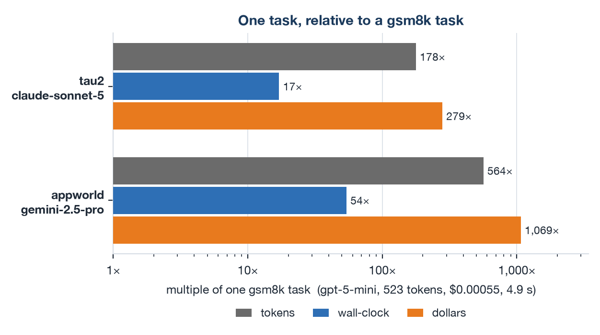
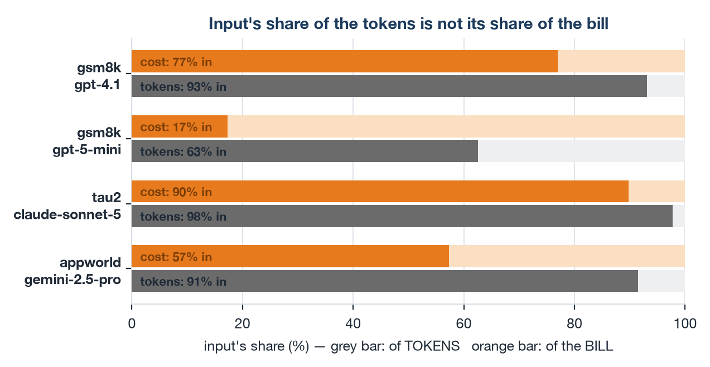
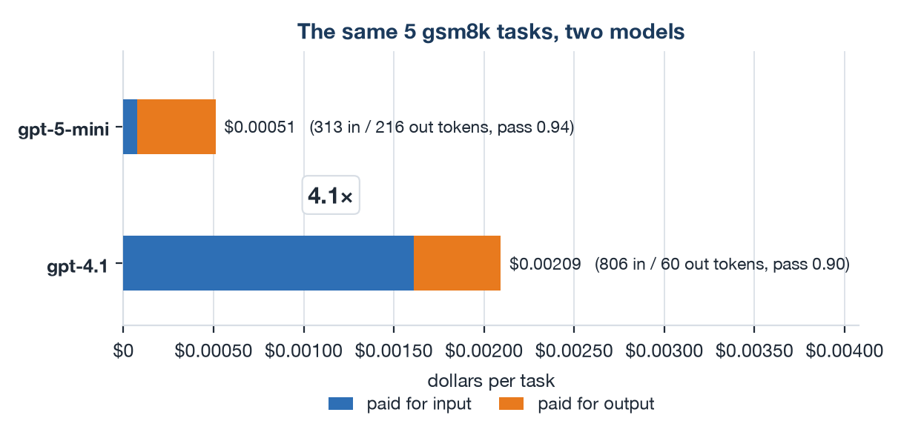
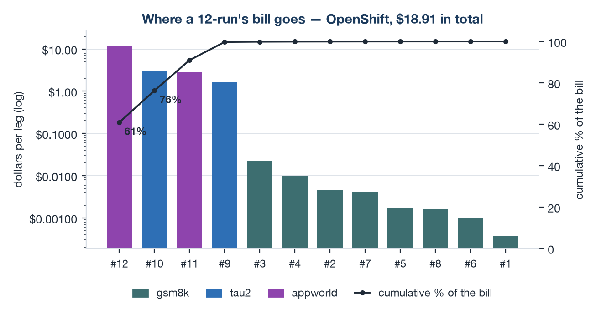
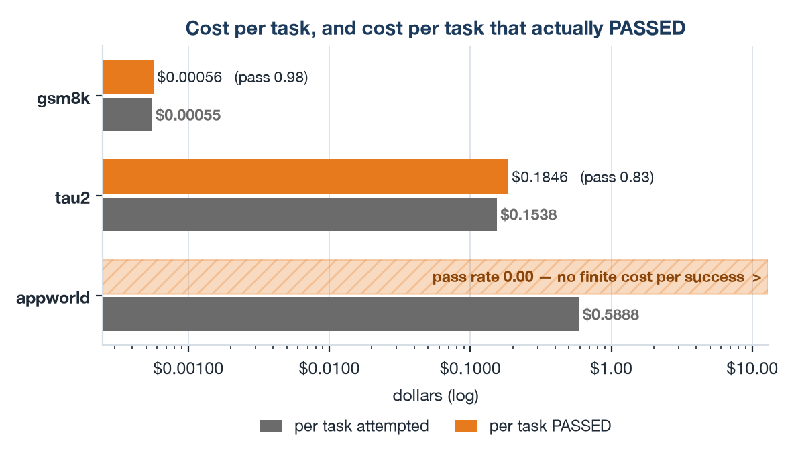
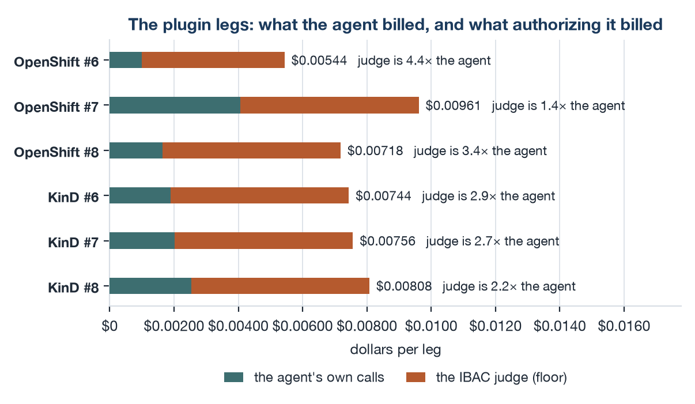

# AutoBench Service — Developer Guide

**Last modified:** 2026-09-21T17:38:30Z

> Hand-maintained, unlike the generated `results/12run-*.md` files which stamp themselves. Bump the
> line above when you edit this guide.

A task-oriented guide to driving the AutoBench Service over its RESTful API. Every
`curl` below is derived from the flows we exercised end-to-end (gsm8k single-turn, tau2
multi-turn) on the `ykt3` and `kind-rossoctl` clusters.

- Reference the machine-readable contract in [`openapi.json`](./openapi.json) /
  [`openapi.yaml`](./openapi.yaml).
- Design rationale (what the Service can and cannot enact) lives in
  [`SERVICE_DESIGN_DECISIONS.md`](./SERVICE_DESIGN_DECISIONS.md) and
  [`KUBECTL_DEPENDENCY_INVENTORY.md`](./KUBECTL_DEPENDENCY_INVENTORY.md).

**In a hurry?** §3 gets you a token, §7.0 is one benchmark run start to finish as copy-pasteable
`curl`, and §7.1 is the same thing as a single command.

<!-- Regenerate this list: python3 reference/gen_toc.py docs/DEVELOPER_GUIDE.md -->
<!-- toc -->

**Contents**

- [1. Mental model (read this first)](#1-mental-model-read-this-first)
  - [Endpoint map](#endpoint-map)
  - [The run-time data path](#the-run-time-data-path)
  - [One task, end to end](#one-task-end-to-end)
  - [Who decides what happens inside a task](#who-decides-what-happens-inside-a-task)
- [2. Cost and performance (which benchmark, and what a run costs)](#2-cost-and-performance-which-benchmark-and-what-a-run-costs)
  - [Picking a benchmark, and what a run costs](#picking-a-benchmark-and-what-a-run-costs)
  - [Token- and cost-efficiency in six figures](#token--and-cost-efficiency-in-six-figures)
  - [The three benchmarks and the 12 runs, compared](#the-three-benchmarks-and-the-12-runs-compared)
- [3. Getting a caller token](#3-getting-a-caller-token)
- [4. Onboarding a benchmark (one-time, per cluster/instance)](#4-onboarding-a-benchmark-one-time-per-clusterinstance)
  - [4.1 Instance config file (`instances/<encoded-iss-host>.json`)](#41-instance-config-file-instancesencoded-iss-hostjson)
  - [4.2 Infrastructure resources (baked into the benchmark definitions)](#42-infrastructure-resources-baked-into-the-benchmark-definitions)
  - [4.3 Workload secrets (provisioned out-of-band as cluster Secrets)](#43-workload-secrets-provisioned-out-of-band-as-cluster-secrets)
  - [4.4 What each benchmark bakes in, and what it needs from you](#44-what-each-benchmark-bakes-in-and-what-it-needs-from-you)
  - [4.5 MLflow + OTEL collector (optional, for reports)](#45-mlflow--otel-collector-optional-for-reports)
- [5. Instance-specific Service config (`/config`)](#5-instance-specific-service-config-config)
- [6. Benchmark lifecycle](#6-benchmark-lifecycle)
  - [6.0 Discover what's available](#60-discover-whats-available)
  - [6.1 Deploy (create the MCP tool + A2A agent)](#61-deploy-create-the-mcp-tool--a2a-agent)
  - [6.2 Wait until Ready](#62-wait-until-ready)
  - [6.3 Submit a run](#63-submit-a-run)
  - [6.4 Poll run status / list runs](#64-poll-run-status--list-runs)
  - [6.5 Get results (report)](#65-get-results-report)
  - [6.6 Download output files from S3](#66-download-output-files-from-s3)
  - [6.7 Tear down](#67-tear-down)
- [7. End-to-end examples (validated flows)](#7-end-to-end-examples-validated-flows)
  - [What you need on the client side](#what-you-need-on-the-client-side)
  - [7.0 Run #1 start to finish, on the ykt3 Service driving ykt2 workloads](#70-run-1-start-to-finish-on-the-ykt3-service-driving-ykt2-workloads)
  - [7.1 The same thing in one command (`autobench-cli`)](#71-the-same-thing-in-one-command-autobench-cli)
  - [7.2 `autobench-cli` options](#72-autobench-cli-options)
  - [7.3 Other validated flows](#73-other-validated-flows)
  - [7.4 The whole 12-run matrix in one command (`reference/run-12.py`)](#74-the-whole-12-run-matrix-in-one-command-referencerun-12py)
  - [7.5 The 12 legs as individual `autobench-cli` commands](#75-the-12-legs-as-individual-autobench-cli-commands)
- [8. Known limits & error codes](#8-known-limits--error-codes)
- [9. Extending the catalog (adding or changing a benchmark)](#9-extending-the-catalog-adding-or-changing-a-benchmark)
  - [9.1 What a definition holds](#91-what-a-definition-holds)
  - [9.2 Add a new benchmark](#92-add-a-new-benchmark)
  - [9.3 Change an existing benchmark](#93-change-an-existing-benchmark)
  - [9.4 What stays runtime-mutable (for contrast)](#94-what-stays-runtime-mutable-for-contrast)
- [10. Regenerating the documents](#10-regenerating-the-documents)

<!-- /toc -->

---

## 1. Mental model (read this first)

The Service is **pure-Python and HTTP-only**. It never calls a cluster API (no kubectl, no
kubeconfig). It talks to the Rossoctl/kagenti backend over HTTPS and to Keycloak for tokens.
Two consequences shape everything below:

1. **Two independent tokens.**
   - The **caller JWT** you present in `Authorization: Bearer …` is used *only* for
     attribution (`preferred_username`) and routing (`iss` selects which instance config
     applies). It is **never forwarded** upstream.
   - For each request the Service mints its **own** ROPC token (the instance's `benchmarker`
     credential, password grant) and presents *that* to Rossoctl.

2. **The Service enacts only what HTTP allows.** It deploys workloads (agents/tools),
   runs benchmarks, reads reports, and exports to S3. It **cannot** create cluster Secrets
   or overlay per-agent ConfigMaps — those are provisioned out-of-band, and the Service
   reports on them (see §4 onboarding and the `424` / `422` responses).

### Endpoint map

| Group | Endpoints | Auth |
|---|---|---|
| Identity | `GET /hello`, `GET /healthz` (public, unschematized) | caller JWT |
| Config | `GET /config`, `PUT /config` | **benchmarker only** |
| Discovery | `GET /namespaces`, `GET /benchmarks`, `GET /benchmarks/{name}` | caller JWT |
| Raw workloads | `GET/POST /agents`, `GET/DELETE /agents/{ns}/{name}`, same for `/tools` | caller JWT |
| Benchmark deploy | `POST /benchmarks/{name}/deploy`, `DELETE /benchmarks/{name}/deploy`, `GET /benchmarks/{name}/status` | caller JWT |
| Run lifecycle | `POST /benchmarks/{name}/runs`, `GET …/runs`, `GET …/runs/{run_id}` | caller JWT |
| Reporting | `GET …/runs/{run_id}/report`, `GET /benchmarks/{name}/report` | caller JWT |

### The run-time data path

The endpoint map above is the **control** plane — what you call. During a run a different set of
**flows** carries the actual work, and none of them are HTTP calls you make. Chart 6 of
[`AutoBench.pptx`](./AutoBench.pptx) draws this; the same eight flows in text, numbered identically:

```
                            ┌──────────────────────────────────┐
                            │    LLM gateway (per instance)    │
                            └───▲───────────────────────▲──────┘
                            (3) │                   (4) │
   ┌─────────────┐    ┌─────────┴────────┐     ┌────────┴─────────────┐
   │  AutoBench  │    │   A2A agent pod  │     │     MCP tool pod     │
   │   Service   │    │                  │     │                      │
   │        (1)  │───►│ agent container  │     │  user simulator      │
   │             │    │         │        │     │  (tau2 only)         │
   │             │    │     (5) ▼        │     │                      │
   │             │    │ AuthBridge ──────┼────►│  MCP server          │
   │             │    │   sidecar   (6)  │     │  tasks + evaluation  │
   │             │    │                  │     │                      │
   │             │    └───────┴──────────┘     └───────────────▲──────┘
   │             │        (7) ▼                                │
   │             │        ┌────────────────┐                   │
   │             │        │   IBAC judge   │ ──(8)─► gateway   │
   └──────┬──────┘        └────────────────┘                   │
          │                                                    │
          └──────────────────────── (2) ───────────────────────┘
```

| # | flow | is the sidecar on it? |
|---|---|---|
| 1 | Service → agent container: `send_prompt`, **once per task** | **yes, inbound** — logged as `a2a-parser`; `isAction=false`, so no judge call |
| 2 | Service → MCP server: `list_tasks`, `create_session`, `evaluate_session`, `delete_session` | no — a different pod, and the Service does not dial through the proxy |
| 3 | agent → LLM gateway: N chat calls per task | **no** — see below |
| 4 | MCP tool → LLM gateway: tau2's user simulator (a *second* model) | no — a different pod |
| 5 | agent → sidecar: the agent's own MCP tool calls | **this is the interception point** |
| 6 | sidecar → MCP server: once the call is authorized | outbound `mcp-parser`, `method=tools/call isAction=true` |
| 7 | sidecar → IBAC judge: one call per `isAction` tool call | — |
| 8 | judge → LLM gateway: the verdict is itself an LLM call | — |

**"Flow", never "leg", for these eight.** Elsewhere in this repo — §7.5 below, `BM_ORDER`, the
comparison reports, [`PLUGIN_OVERHEAD.md`](./PLUGIN_OVERHEAD.md) — a **leg** is one of the 12
parameterized *runs*. Both numberings reach 8, so "leg 6" is ambiguous where it matters: as a run it
is `ibac-only`, as a flow it is sidecar → MCP server.

Three things about this shape are not guessable from the API surface:

**The agent has its own MCP connection, separate from the Service's.** `MCP_URL` is injected into the
agent's env at deploy time (always `svc.cluster.local`, since agent→tool is intra-cluster even on a
cross-cluster run). The Service opens and grades the session (flow 2); the agent's tool calls
(flows 5–6) mutate that same session's state, correlated by `session_id` — which travels as A2A
request metadata, *not* in the prompt text. So grading reads tool-side state, and the runner discards
whatever the agent replies: an agent that answers in prose without making the submitting tool call
fails the task.

**Interception is a blanket forward proxy plus an allowlist, not a tool-aware hook.** With AuthBridge
enabled the operator injects `HTTP_PROXY=HTTPS_PROXY=http://127.0.0.1:8081` — the sidecar — into the
agent pod, which would capture *every* outbound HTTP call it makes, inference included. What keeps
flow 3 out of it is the instance config's `no_proxy`, which names the LLM gateway host (and the OTEL
collector, and Keycloak). IBAC additionally sets `judge_inference: false`, so even proxied inference
would not be judged. Both would have to change for the agent's model calls to be authorized.

**A ready sidecar proves nothing about enforcement.** Because the switch is a proxy-env allowlist, a
plausible-looking config can leave the outbound plugins seeing no traffic at all: setting
`workload_llm.disable_proxy: true` makes the Service inject `HTTP_PROXY=""` first, and the operator
only adds a var when it is *absent*, so it skips `HTTP_PROXY` while still setting `HTTPS_PROXY`.
`MCP_URL` is `http://`, so tool calls went direct — and a `no_proxy` containing
`.svc.cluster.local` excluded them a second time. The sidecar was ready, the pipeline rendered, the
judge was called **zero** times. Keep `disable_proxy` off and keep the *wildcards* out of `no_proxy`
while keeping the named hosts in it, then verify by **counting judge completions across a run** — IBAC
emits no log line of its own, so sidecar logs cannot tell you. `initialize` and `tools/list` are
`isAction=false` and legitimately never reach the judge, so a zero count only means something if real
tool calls occurred. Cost figures for each layer: [`PLUGIN_OVERHEAD.md`](./PLUGIN_OVERHEAD.md).

### One task, end to end

The flows above are spatial. This is the same system in time — one task, from the Service's first call
to its last, with the span each step appears as:

```
Service:  create_session(task_id)                    → MCP pod     [MCP.CreateSession]
Service:  send_prompt(task text; session_id in A2A   → agent       [Agent.Call]
          request metadata)                                        ── ONE message, once per task
  agent:    connect_mcp — tools/list                 → MCP pod     [connect_mcp]     ~27–38 ms
  agent:    create_agent                                           [create_agent]    6.7 ms warm,
                                                                    up to 6.5 s on a cold pod
  agent:    initial_observation — local, no I/O                    [execute_tool initial_observation]
                                                                    ~50 µs, never counted
  agent:    LOOP  chat(model) → execute_tool(…)      → MCP pod     [chat <model>]
                  → observation → chat → …                         [execute_tool <tool>]
  agent:    returns its final message, when the model asks for no further tool
Service:  evaluate_session                           → MCP pod     [Evaluator.Evaluate]
Service:  delete_session                             → MCP pod     (in a `finally`; no span)
```

Five things that trace makes concrete:

- **One A2A turn per task.** Everything the agent does — every model call, every tool call — happens
  inside that single streaming request. The agent-side `POST /` span brackets it, so `Agent.Call −
  POST /` is the Service's own per-task cost: **16.9 ms of a 10.4 s gsm8k task, 13.2 ms of a 70.3 s
  tau2 one**.
- **The Service issues no tool call.** Its MCP traffic is `list_tasks`, `create_session`,
  `evaluate_session`, `delete_session`. `execute_tool` is the agent's outbound call, named by the
  agent; the Service never learns a tool's name.
- **The tool list is fetched per task, not per pod.** `connect_mcp`, `create_agent` and `invoke_agent`
  each appear exactly once per task in every leg.
- **The session id is the only thing joining the two halves.** It travels in A2A request metadata, never
  in the prompt text, and it is why the agent's tool calls mutate the session the Service will grade.
- **The reply text is discarded.** Grading reads the session's final state, so on gsm8k the answer has
  to arrive through the `submit` tool call; prose alone fails the task.

### Who decides what happens inside a task

The eight flows say who *talks to* whom. They do not say who **decides** — and the answer surprises
people: the sequence of model calls and tool calls inside a task is **defined nowhere**. It is
produced, one step at a time, by the model.

| component | defines | does **not** define |
|---|---|---|
| **MCP pod** | the task list; each task's initial state and instruction; the **tool surface** — names, schemas, semantics, and the observations tools return; the **evaluator** (`evaluate_session` → verdict) | any ordering. It answers calls; it never asks for one |
| **agent runtime** (inside the agent image) | the **loop** — model → tool → observation → model — and when to stop | which tool, with which arguments |
| **the Service** | one prompt per task (`runner/prompt.py`: the task text plus optional context, and no tool instructions), the session lifecycle, the per-task timeout, the telemetry | anything about the trajectory |
| **the model** | **every step** | — |

**Deterministic task *selection*, nondeterministic task *execution*.** The runner always slices the
first `max_tasks` ids off a fixed list, which is what makes legs comparable. Within a task nothing is
fixed: the same task id, same model, same platform, run in two different legs, takes a different
number of steps — tau2 task `2` went 13 chat / 13 tool in one leg and 9 / 9 in another; appworld
`3d9a636_3` went 20 / 10 and 26 / 13. Of the tasks that appear in more than one leg, **8 of 10 tau2
tasks and 3 of 3 appworld tasks differ**; the 10 that agree are all gsm8k, where the shape is
1 chat / 1 tool and there is nothing to vary.

**How the model knows when to stop.** Not from our prompt — the terminal tool's name appears nowhere
in the Service. The agent fetches the tool declarations from the MCP pod at `connect_mcp`, and the
benchmark's own schema descriptions are what mark one tool as the answer/finish channel. On gsm8k the
entire first model call is **320 input tokens** — the runtime's system prompt, our task text and
every tool schema combined — so that instruction is a terse tool description, not a protocol. In
practice it lands: gsm8k ends on `submit` in **173 of 173** tasks and appworld on `finish` in **34 of
35** (the exception timed out mid-task). tau2 has **no** terminal tool at all — all **60 of 60** tasks
end on `message`, a reply to the simulated customer, the loop exiting simply because the model asked
for no further tool.

Two consequences worth carrying into every number downstream. Grading reads the session's **final
state**, never a reference trajectory, so a task can pass by two routes at different token cost — per-task
cost and latency are distributions, which is why the reports carry CV columns rather than
point figures. And an appworld gap between platforms is not automatically a platform difference: the
turn counts differ run to run on their own.

<sub>Counts computed over every mirrored `span_report.ndjson` from the v1.28 matrix, both platforms: per task, `counted` chat and tool spans, grouped by (benchmark, task id, model).</sub>

## 2. Cost and performance (which benchmark, and what a run costs)

Everything above is mechanism: what the pieces are and who decides what. This section is the
money and the minutes — which benchmark answers your question, what a leg of it costs in tokens
and dollars, and which of those numbers are safe to divide. Every figure here is measured from
the v1.28 matrices, not estimated; the generators that compute them are in
[10. Regenerating the documents](#10-regenerating-the-documents).

### Picking a benchmark, and what a run costs

| If you want to… | use | on model | costs about |
|---|---|---|---:|
| check a cluster/deploy/auth/telemetry path works | **gsm8k**, 1–10 tasks | gpt-5-mini | < $0.01 |
| exercise concurrency and volume cheaply | **gsm8k**, 50 tasks at `max_parallel_sessions=4` | gpt-5-mini | $0.02 |
| compare models meaningfully | **tau2** (it discriminates; gsm8k saturates at ~1.0) | claude-sonnet-5 | $1.70 / 10 tasks |
| stress long contexts, long tasks, timeouts | **appworld** | gemini-2.5-pro | $1.90–2.80 / 5 tasks |
| get a fast signal that nothing regressed | **gsm8k** — if it fails, stop and fix infrastructure | gpt-5-mini | < $0.01 |

**What one task costs — and on which model.** Pooled over the 267 task rows of the published v1.28
pair ([`docs/results/v1.28-2026-09-15/`](results/v1.28-2026-09-15/)); `latency` is the median, tokens
are the mean. **Read the model row first:** the dollar rows are a product of tokens *and* a rate, the
three benchmarks do not run the same model, and each rung's default is dearer than the one below it —
so no dollar figure here transfers to a different model.

| per task | gsm8k | tau2 | appworld |
|---|---:|---:|---:|
| **model (the benchmark's default)** | **`Azure/gpt-5-mini`** | **`aws/claude-sonnet-5`** | **`gemini-2.5-pro`** |
| its rate, in / out $ per 1M | 0.25 / 2.00 | 1.52 / 7.60 | 1.25 / 10.00 |
| LLM calls | 1.10 | 11.38 | 29.20 |
| input tokens | 341 | 90,902 | 269,953 |
| output tokens | 180 | 2,061 | 25,140 |
| **total tokens** | **520** | **92,963** | **295,093** |
| × a gsm8k task, in **tokens** | 1× | 178× | 564× |
| **cost at our gateway's rates** | **$0.00055** | **$0.154** | **$0.589** |
| × a gsm8k task, in **dollars** | 1× | 279× | 1,069× |
| cost of 100 tasks | $0.06 | $15.38 | $58.88 |
| input share of tokens | 66% | 98% | 92% |
| input share of **cost** | 31% | 90% | 57% |
| median task latency | 4.9 s | 84 s | 264 s |
| …of it inside model calls | 90% | 58% | 96% |
| pass rate | 0.97 | 0.83 | 0.00 |
| tokens per **passed** task | 537 | ~112 K | no finite value |

The three benchmarks are a deliberate **difficulty ladder** — gsm8k, then tau2, then appworld, each
rung roughly an order of magnitude more of everything than the one below it. **Money amplifies that
ladder rather than tracking it**, because climbing a rung also switches you to a dearer model: tau2 is
178× a gsm8k task in tokens but **279×** in dollars, appworld 564× but
**1,069×**. Any budget scaled off the token ratios is short by 1.6–1.9×. And **the cost share, not the
token share, names the cost driver** — output is priced 4–8× input everywhere, so input is 66% of
gsm8k's tokens but only 31% of its bill. Only tau2 is genuinely input-dominated in money (90%), and it
is the one benchmark where a cheaper-input model really does beat a terser one.

gsm8k's column pools its two models, which the [figures below](#token--and-cost-efficiency-in-six-figures)
separate: 161 of its 171 priced rows ran gpt-5-mini and 10 ran gpt-4.1, whose per-task cost is 4.6×
higher. The dollar rows also cover 266 of the 267 rows — one task on OpenShift leg #6 died before its
first model call, so it carries `model: unknown` and no cost, and its exclusion is why the ratio rows
divide by a 523-token gsm8k task rather than the rounded 520 above.

**The rate card.** Read off the LiteLLM admin UI's per-model pages on **2026-09-17** and kept in
[`reference/model_prices.json`](../reference/model_prices.json), which is the single source every
figure here is computed from — no generator hardcodes a price. **These are our gateway's posted rates,
not an invoice and not a vendor's list price.**

| model | provider | in $/1M | out $/1M | out/in | used by |
|---|---|---:|---:|---:|---|
| `Azure/gpt-5-mini-2025-08-07` | azure | 0.25 | 2.00 | 8.0× | gsm8k default |
| `gemini-2.5-pro` | vertex_ai | 1.25 | 10.00 | 8.0× | appworld |
| `aws/claude-sonnet-5` | bedrock | 1.52 | 7.60 | 5.0× | tau2 |
| `Azure/gpt-4.1` | azure | 2.00 | 8.00 | 4.0× | leg #4, **and the IBAC judge** |

```sh
# regenerate every dollar figure in this section rather than editing one
python3 reference/gen-cost-analysis.py /tmp/autobench/run12-{ocp,kind}-dev146.json
```

**What one leg costs.** Measured totals for the canonical legs (§7.4), both platforms:

| leg | tokens (OpenShift) | $ (OpenShift) | tokens (KinD) | $ (KinD) |
|---|---:|---:|---:|---:|
| #1 gsm8k, 1 task | 470 | $0.0004 | 790 | $0.0010 |
| #2 gsm8k, 10 tasks | 5.1 K | $0.0046 | 5.1 K | $0.0047 |
| #3 gsm8k, 50 tasks `p=4` | 25 K | $0.0225 | 24 K | $0.0212 |
| #9 tau2, 10 tasks | 1.01 M | $1.66 | 1.04 M | $1.73 |
| #10 tau2, 20 tasks `p=4` | 1.74 M | $2.90 | 1.78 M | $2.94 |
| #11 appworld, 5 tasks | 1.49 M | $2.79 | 0.93 M | $1.90 |
| #12 appworld, 20 tasks `p=4` | 5.71 M | $11.52 | 2.20 M | $4.40 |
| **all 12 legs** | **10.0 M** | **$18.91** | **6.0 M** | **$11.02** |

**Budget by benchmark, not by task count.** All eight gsm8k legs together are **0.2%** of the
matrix's bill on OpenShift and 0.4% on KinD; appworld's two legs are **76%** and 57%; tau2's two are
24% and 42%. A 50-task gsm8k leg costs 2 cents — less than one twenty-fifth of a single appworld task.
And the same request body is not the same bill on two clusters: #12 cost 2.6× more on OpenShift,
because appworld turn counts are nondeterministic and the slower cluster's tasks ran longer before the
600 s per-task timeout. That is also why the two matrix totals are not a platform comparison —
OpenShift completed 18 appworld tasks against KinD's 10, so it did more work, not just dearer work.
Size appworld against your own cluster.

**Model choice is a cost decision too.** Legs #4 and #5 ran the **identical five gsm8k tasks** at
`p=4`, differing only in model:

| same 5 gsm8k tasks | gpt-4.1 | gpt-5-mini |
|---|---:|---:|
| pass rate (OpenShift / KinD) | 0.80 / 1.00 | 1.00 / 1.00 |
| LLM calls per task | 2.8 – 3.0 | 1.0 |
| input tokens per task | 775 – 837 | 313 |
| output tokens per task | 57 – 63 | 125 – 368 |
| total tokens per task | 832 – 900 | 438 – 681 |
| median task latency | 10.4 – 10.8 s | 11.2 – 16.4 s |
| **cost per task** | **$0.0020 – 0.0022** | **$0.00033 – 0.00081** |

The reasoning model answers in **one** call; gpt-4.1 takes ~3 tool round-trips, so it sends 2.6× the
input and emits about a quarter of the output. **gpt-4.1 costs 4.1× gpt-5-mini on this identical
work** — mean of its 2 legs against gpt-5-mini's 7, the ratio spanning 2.5–6.7× depending on which
pair of legs you compare, because gpt-5-mini's output length swings with reasoning effort. On our card
the input side decides it alone: 2.6× the tokens at 8× the price is a **21×** input bill, and the
output side cannot offset it (gpt-5-mini emits 3.6× more output at a quarter the rate, so the two
output bills land within 10% of each other).

**Which model is cheaper is a property of your price list, not of the models.** Compute it rather than
inheriting our answer:

```
cost per task  =  (input_tokens × P_in  +  output_tokens × P_out) / 1e6
```

**Every number above is a floor, for five reasons.** A task killed by `task_timeout_seconds` burns
tokens but leaves no `report.ndjson` row, so appworld's 15 timed-out tasks are missing from these
totals. tau2's user simulator runs in the **MCP** pod, which is not instrumented — its inference is
billed by the gateway and counted nowhere here (the tell: 27% of a tau2 task's wall time sits inside
tool calls, against <1% for the other two, and every `chat` span carries the *agent's* model). A leg
that replays the gateway's completion cache re-reports stored `usage` for calls that were never made
upstream, so a cache-contaminated leg can also read *high*. Plugins add judge calls that are billed
but not in the agent's spans: the IBAC judge runs `Azure/gpt-4.1` on a fixed 1,577-char system prompt,
so **≥ $0.00111 per authorized tool call** — 2.4× the whole gsm8k task it guards, and 1.4–4.4× the
agent's own bill across legs #6–#8 (see [`PLUGIN_OVERHEAD.md`](./PLUGIN_OVERHEAD.md)). Conversely the
*input* figures are an upper bound: the gateway reports `usage.prompt_tokens_details.cached_tokens`
but publishes no cached-input rate, and `report.ndjson` stores one undifferentiated
`llm_input_tokens`, so no past run can be re-priced. If cached input were free, tau2 would floor at
$0.0157 a task and appworld at $0.251 — the `input share of cost` row is the bound.

### Token- and cost-efficiency in six figures

Six things we can now state as measurements rather than intuitions. Each figure carries **one**
take-away, in bold under it; the sentence and the picture are produced together by one generator, so
they cannot drift apart:

```sh
uv run --with matplotlib python reference/gen-cost-charts.py \
    results/v1.28-dev146/run12-ocp-dev146.json results/v1.28-dev146/run12-kind-dev146.json
```

That writes `docs/img/*.png`, the take-away text it embeds into this section, and
`docs/img/takeaways.json` — which is what the slide deck reads, so the deck's captions are the same
strings. Nothing below is hand-written: to change a number, change the artifacts or
`reference/model_prices.json` and re-run.

<!-- charts -->

#### Figure 1 — Money climbs the ladder faster than tokens



**Money climbs the difficulty ladder faster than tokens do: tau2 is 178× a gsm8k task in tokens but 279× in dollars, appworld is 564× a gsm8k task in tokens but 1,069× in dollars — so a budget scaled off the token ratios is short by 1.6–1.9×.**

Each rung is a different model, which is why the dollar bar outruns the token bar: climbing the ladder also buys a dearer model. Wall-clock climbs SLOWEST of the three (17× tau2, 54× appworld), because the harder benchmarks parallelize their turns while their bills add up.

<sub>gsm8k baseline: 523 tokens, $0.00055, 4.9 s median, over 171 task rows.</sub>

#### Figure 2 — Read the share of the BILL, not the share of tokens



**Output is priced 4–8× input on every model we use, so the token split misstates the bill every time: gsm8k on gpt-5-mini is 63% input by tokens and only 17% by cost.**

The gap is the reason a model can win on token count and lose on the invoice. It also says where to look for savings: only tau2 is genuinely input-dominated in money, so it is the one benchmark where a cheaper-input model beats a terser one — everywhere else verbosity is the thing to control.

<sub>Both bars are per-task means over every priced row of that benchmark and model.</sub>

#### Figure 3 — Model choice is settled on the input side



**gpt-4.1 costs 4.1× gpt-5-mini on the identical 5 gsm8k tasks, and the input side decides it alone: 21× the input bill, against an output bill the two models split within 10%.**

Mean of gpt-4.1's 2 legs against gpt-5-mini's 7; leg to leg the ratio spans 2.5×–6.7×, because the reasoning model's output length swings with how much it reasons. Note the shape rather than the winner: gpt-5-mini answers in one call and emits MORE output, gpt-4.1 takes ~3 tool round-trips and sends far more input. Which one is cheaper is a property of the price list, not of the models.

<sub>The task set is identical and task selection is deterministic, so this is the one comparison in the matrix with no workload difference to explain away.</sub>

#### Figure 4 — Two legs of twelve are most of the bill



**Two of the twelve legs are 76% of a matrix's bill, while all 8 gsm8k legs together are 0.2% of it — so budget by benchmark, not by task count.**

The bars are log-scaled because a linear axis renders every gsm8k leg as nothing at all, which is itself the finding: there are only two legs worth watching. It is also why the cheap legs are the ones to iterate on — a full gsm8k sweep costs less than a rounding error on one appworld leg.

<sub>OpenShift; the ordering reproduces on the other platform, the absolute appworld figures do not (nondeterministic turn counts).</sub>

#### Figure 5 — Efficiency only means anything per SUCCESS



**Dividing by the pass rate is what turns a token count into an efficiency figure: gsm8k $0.00055 per task becomes $0.00056 per PASS; tau2 $0.1538 per task becomes $0.1846 per PASS — and appworld has no finite cost per success at all, because it passed nothing.**

A change that halves your token use and halves your pass rate has gained you nothing, which is why we never quote tokens per task as an efficiency number on its own. The unbounded row is not a rendering artifact: it is the honest way to report a benchmark that runs to completion, records every token, and then fails evaluation.

<sub>Pass rates here are over PRICED rows; the headline rates in the reports use the tasks attempted, which is a lower number for appworld because a timed-out task leaves no row.</sub>

#### Figure 6 — On the plugin legs, the check outcosts the work



**One IBAC judge completion costs at least $0.00111 — 2.4× the entire gsm8k task on gpt-5-mini it is authorizing — so across legs #6/#7/#8 the judge bills 1.4–4.4× what the agent does.**

The judge runs gpt-4.1, the dearest model on our card, against a FIXED 1,577-character system prompt that does not shrink with the task — so the cheaper the work, the more lopsided this gets. None of it appears in report.ndjson: the sidecar makes the call, not the instrumented agent, which is why every other figure in this section is a FLOOR.

<sub>Judge cost is tool calls × the floor per call; the proposed-action block that follows the fixed prompt is not counted. tau2's user simulator is invisible the same way, inside the uninstrumented MCP pod.</sub>

<!-- /charts -->

### The three benchmarks and the 12 runs, compared

The figures above price the work. This is what the work *is*, and what having run it is worth.

**The three benchmarks.** They differ in the shape of a task, not just its size — which is why the
ladder is a ladder and not three sizes of the same test:

| | **gsm8k** | **tau2** | **appworld** |
|---|---|---|---|
| **A task is** | one grade-school word problem, answered in text | one customer-service conversation in the `retail` domain, against a simulated user | one multi-app scenario (email, phone, shopping…) automated through an API surface |
| **Turn structure** | one model call, ~1 tool call | ~11 model calls alternating with a **user simulator** that replies in character | ~29 model calls over a long horizon, every call re-sending the whole conversation |
| **Ends when** | the answer is emitted | the dialogue reaches a resolution or the policy is violated | the scenario's goal state is reached, or the 600 s task timeout kills it |
| **Scored by** | exact numeric match | task-completion + policy compliance, per tau2's own scorer | appworld's own state assertions — all-or-nothing |
| **It exists to test** | that the *plumbing* works: deploy, auth, telemetry, scoring, S3 export | that the agent can **hold state across turns** and use tools under a policy | that the agent survives **long horizons** — context growth, timeouts, partial failure |
| **A result is worth** | a go/no-go on infrastructure. It saturates near 1.0, so it cannot rank models | a genuine model/configuration comparison — it discriminates, and its 0.83 leaves headroom in both directions | a stress signal, not a capability score: at 0.00 it tells you what *breaks*, not who is better |
| **Watch out for** | a pass rate of 1.0 proves nothing about the agent | its user simulator's inference is billed but **not** in our telemetry | 15 of 50 tasks time out; a killed task leaves no `report.ndjson` row at all |

**Where their value actually lies.** gsm8k is the only one cheap enough to run on every change, and
that is its entire point — it is a **smoke test with a score**, and treating its 0.97 as a model
measurement is the most common misreading of these numbers. tau2 is the only rung that discriminates:
it is multi-turn, so it fails in *informative* ways (a wrong answer, a policy violation and a dropped
thread are different failures), and its pass rate moved with configuration in our matrices while
gsm8k's did not. appworld earns its place precisely because it fails: a benchmark that nothing passes
still answers "does the platform survive a 4-minute, 300 K-token task at 4-way concurrency?", and it
is the only leg that has ever exposed a timeout, a context limit or a cache effect before a user did.

**The 12 runs.** One matrix is 12 legs, each changing exactly one thing against the leg before it, so
a difference has one candidate explanation:

| legs | what they parameterize | what having run them established |
|---|---|---|
| **#1–#3** gsm8k 1 → 10 → 50 tasks, `p=1 → 4` | volume, then concurrency | the pipeline is stable and **deterministic**: 6 of 12 legs have byte-identical input-token totals across two clusters, which is the strongest like-for-like check available |
| **#4** gsm8k on gpt-4.1 | model swap on **identical** tasks | the only clean model comparison in the matrix — `gpt-4.1` costs **4.1×** `gpt-5-mini` for no pass-rate gain at this difficulty |
| **#5–#8** gsm8k under AuthBridge: auth-only, ibac-only, full, full + per-plugin override | one security layer at a time, same five tasks | plugin cost is **platform-specific**: OpenShift pays in the sidecar (+13.68 s/task), KinD in the judge (+1.54 s) — so a per-task overhead figure is meaningless without naming the cluster ([`PLUGIN_OVERHEAD.md`](./PLUGIN_OVERHEAD.md)) |
| **#9–#10** tau2 10 → 20 tasks, `p=1 → 4` | multi-turn, then multi-turn under load | multi-turn works end to end, including the user simulator — and tau2 is where pass rates carry information (0.75–1.00 across sides) |
| **#11–#12** appworld 5 → 20 tasks, `p=1 → 4` | long horizon, then long horizon under load | the limits are real and they are **upstream**: 15 timeouts, a 0.00 pass rate, and 76% of the matrix's bill in two legs |

**What the matrix as a whole is worth.** Its value is not the pass rates — it is that **the same 12
request bodies produce comparable measurements on two unlike clusters**. In the published v1.28 pair:
token capture was complete (0 of 267 rows lost their usage span), every task reached the model (0
health-probe losses), and 7 of 12 pass rates matched exactly. The 5 that differed are mostly
arithmetic on small runs — one task moves a 5-task leg by 0.20 — which is why the reports carry a
**per-cause** failure table (transport 1/0, timeout 4/11, upstream-agent defect 1/0, wrong answer
2/1): a task lost to a socket and a task lost to a wrong answer land in the same denominator and only
one of them says anything about the agent. Read the cause table, then the rate.

Two limits of the matrix worth stating in the same breath. **Absolute latency does not travel**: the
same condition on the same image measured 4–93× apart between our clusters, so seconds are always
qualified by cluster while pass rates and token counts travel fine. And **the deploy, not the task, is
the unit of replication** — every task in a leg shares one deployment, so adding tasks tightens the
wrong interval; if you need a tighter number, add deploys.

Newcomer-facing versions of these tables, with what each benchmark actually is:
[`BENCHMARKS_PRIMER.md`](./BENCHMARKS_PRIMER.md).

---

## 3. Getting a caller token

The caller JWT is a normal Keycloak token from the instance's realm. Obtain it via the
password grant (the same Direct-Access-Grants flow the dev/test users use). The realm and
token endpoint are derived from the instance `iss`
(`<iss-origin>/realms/<realm>/protocol/openid-connect/token`).

```bash
# --- Environment (pick the block for your target cluster) ---

# Option A — ykt3 (OpenShift; realm/client "kagenti"), the cluster the e2e runs were validated on:
export SVC="https://autobench.apps.ykt3.example.com"     # AutoBench Service base URL
export KC="https://keycloak.apps.ykt3.example.com"          # Keycloak base (iss origin)
export REALM="kagenti"                                       # realm from the iss
export KC_CLIENT="kagenti"                                   # public client with Direct Access Grants

# Option B — kind-rossoctl (local; realm/client "rossoctl"):
#   The instance's iss is http://keycloak.localtest.me:8080/realms/rossoctl, but in-cluster the
#   Service reaches Keycloak via keycloak_backchannel_url. You still fetch YOUR token from the
#   externally reachable route below (localtest.me resolves to 127.0.0.1).
# export SVC="http://autobench.localtest.me:8080"
# export KC="http://keycloak.localtest.me:8080"
# export REALM="rossoctl"
# export KC_CLIENT="rossoctl"

# Attribution matters: config endpoints require preferred_username == "benchmarker".
# Any valid realm user works for deploy/run/report.
# Never hardcode the password — supply it out-of-band (env, secret manager, or an
# interactive prompt). e.g.: read -rs -p "benchmarker password: " KC_PASS; export KC_PASS
export KC_USER="benchmarker"
export KC_PASS="${KC_PASS:?set KC_PASS in your environment; do not commit it}"

export TOKEN=$(curl -s "$KC/realms/$REALM/protocol/openid-connect/token" \
  -d grant_type=password \
  -d client_id="$KC_CLIENT" \
  -d username="$KC_USER" \
  -d password="$KC_PASS" \
  | python3 -c 'import sys,json; print(json.load(sys.stdin)["access_token"])')

# Sanity check: the Service echoes the validated claims + which instance you routed to.
curl -s "$SVC/hello" -H "Authorization: Bearer $TOKEN" | python3 -m json.tool
```

`GET /hello` returns `{iss, preferred_username, rossoctl_base_url, claims}`. If you get
`401`, the token is missing/invalid; `403 issuer not in scope` means no instance file
matches the token's `iss` (see §4.1).

> **Why the kind block differs:** in-cluster the public `iss` host is unreachable, so the
> instance file sets `keycloak_backchannel_url` and the Service dials *that* for JWKS/ROPC.
> This only affects the Service's own dialing — your caller token still comes from the
> externally reachable Keycloak route (Option B above).

---

## 4. Onboarding a benchmark (one-time, per cluster/instance)

These steps are **out-of-band** — the Service verifies them but cannot perform them.

### 4.1 Instance config file (`instances/<encoded-iss-host>.json`)

One file per instance keys the whole thing to the `iss`. Loaded at startup from
`settings.instances_dir`. Shape:

```json
{
  "iss": "https://keycloak.apps.ykt3.example.com/realms/kagenti",
  "keycloak_backchannel_url": null,
  "rossoctl_base_url": "https://kagenti-backend.kagenti-system.svc.cluster.local:8000",
  "service_credential": {
    "client_id": "kagenti",
    "client_secret": "",
    "username": "benchmarker",
    "password": "<benchmarker-password>"
  },
  "mlflow": { "tracking_url": null },
  "s3": { "bucket": null },
  "mcp_endpoint_template": null,
  "agent_endpoint_template": null,
  "workload_otel": null
}
```

- `service_credential` is the ROPC identity the Service presents to Rossoctl (must exist in
  the realm with `firstName`/`lastName` set, or Keycloak 400s with "Account is not fully set
  up").
- `mcp_endpoint_template` / `agent_endpoint_template` are only needed when the workloads live
  on a **different** cluster reachable via external routes (use `{service}`/`{namespace}`
  placeholders). Leave `null` for co-located in-cluster workloads.
- `mlflow` / `s3` can be seeded here or set later via `PUT /config` (§5).

### 4.2 Infrastructure resources (baked into the benchmark definitions)

The Service sends CPU/memory requests+limits in the create body, so no post-create patch is
needed. Current values (from `benchmarks/registry.py`):

| Workload | requests | limits |
|---|---|---|
| MCP tool | `500m` CPU / `512Mi` | `4` CPU / `4Gi` |
| A2A agent | `500m` CPU / `512Mi` | `4` CPU / `2Gi` |

### 4.3 Workload secrets (provisioned out-of-band as cluster Secrets)

The Service has **no Secrets API**. It references these by name in the deploy body; if a
Secret is missing the workload never becomes Ready, and the run precheck returns **`424`**
naming exactly what to provision.

| Benchmark | Secret (`name` → `key`) | Consumed by | Purpose |
|---|---|---|---|
| gsm8k | `hf-secret` → `hf-token` | tool | HuggingFace dataset access |
| gsm8k / tau2 / appworld | `openai-secret` → `apikey` | agent (+ the tau2 tool, for its user simulator) | LiteLLM API key |

Provision them on the workload cluster before deploying, e.g.:

```bash
kubectl -n team1 create secret generic hf-secret --from-literal=hf-token="$HF_TOKEN"
kubectl -n team1 create secret generic openai-secret --from-literal=apikey="$LITELLM_KEY"
```

> **`openai-secret` must exist before you run the Service — provision it out-of-band.**
> On clusters where the rossoctl platform chart owns the agent namespaces (e.g. `team1`), the
> chart only manages `openai-secret` when its Helm value `secrets.openaiApiKey` is set. Leave
> that value **empty** and create the Secret yourself (command above / a secret manager /
> External Secrets), so the credential lives outside Helm values and a later `helm upgrade`
> **cannot** overwrite it with an empty key. When the value is empty the chart skips the Secret
> entirely and its install NOTES print a `WARNING: secrets.openaiApiKey is NOT set` reminder.
> If you instead let the chart template the key, every `helm upgrade` re-applies whatever is in
> the release values — an empty value there silently zeroes the key mid-flight and every LLM
> call fails until the Secret is restored and the workload pods are `rollout restart`ed (pods
> read `apikey` via `secretKeyRef` only at startup).

### 4.4 What each benchmark bakes in, and what it needs from you

The division of labour is easy to get backwards: **the benchmark itself — dataset, world,
evaluator — is inside the MCP image**, and `tool_env` (`registry.py`) adds only the credentials and
the per-benchmark quirk overrides. There is no config knob for the dataset or the domain.

| | what's baked in | `tool_env` it needs |
|---|---|---|
| **gsm8k** (`exgentic-mcp-gsm8k`) | the HuggingFace dataset loader, pinned to the `main`/`test` split — those 1,319 rows are fetched at pod startup | `HF_TOKEN` (from `hf-secret`), plus `EXGENTIC_SET_BENCHMARK_RUNNER=direct` |
| **tau2** (`exgentic-mcp-tau2`) | the τ²-bench library + its `retail` domain (114 tasks), and a user-simulator LLM | `OPENAI_API_KEY` (from `openai-secret`) + `EXGENTIC_SET_BENCHMARK_ACTION_TIMEOUT=1000` — it makes its own inference calls (flow 4) |
| **appworld** (`exgentic-mcp-appworld`) | the whole app-suite sandbox (`exgentic install --benchmark appworld`) — upstream appworld at commit `edc96012` wrapped in a *custom* tool-per-API adapter, served from the `test_normal` split (168 tasks) | just `BENCHMARK_NAME` — upstream's `.env.appworld` is explicitly empty |

Every benchmark also gets `BENCHMARK_NAME` and an `OPENAI_API_BASE` that the Service **injects per
deploy** from the instance's `workload_llm.api_base` (§4.1) — never baked into the image; a deploy
with no gateway configured is rejected with `422` rather than falling back to a default. tau2's
simulator model is injected the same way, from the run's model.

Two edges worth knowing before you copy env between benchmarks:

- **appworld rejects the action-timeout override tau2 requires** and crashes at startup with
  `Unknown benchmark override 'action_timeout'`. The env is per-benchmark, not a shared default.
- **`hf-secret` must exist for gsm8k even though the dataset is public.** Without it the MCP pod
  sits in `CreateContainerConfigError` and the agent crash-loops; with an empty value it works.

The **agent** side, by contrast, is the same everywhere: one image
(`exgentic-a2a-tool_calling:latest`) is the only entry in all three `agents={…}` maps, gaining just a
`-<benchmark>` name suffix. So the benchmark lives in the MCP pod and the subject under test is the
same binary every time.

### 4.5 MLflow + OTEL collector (optional, for reports)

Reporting is fail-soft: if MLflow client-creds aren't configured, runs still succeed and
export to S3, but `report.ndjson` is empty and the report endpoints return `409`. To enable,
provision an OTEL collector (forwards agent spans to MLflow) out-of-band and set the MLflow
read creds via `PUT /config`.

---

## 5. Instance-specific Service config (`/config`)

`GET`/`PUT /config` are **benchmarker-only** (`preferred_username == "benchmarker"`; else
`403`). They set only what the Service itself enacts — MLflow (read side) and S3. Attempting
to set a workload credential is rejected with **`422`** (`extra="forbid"`). Secrets are
redacted in responses.

```bash
# View effective config for your instance (file defaults + any overrides), secrets redacted.
curl -s "$SVC/config" -H "Authorization: Bearer $TOKEN" | python3 -m json.tool

# Point the Service's result sink at an S3 bucket + wire up MLflow read creds.
curl -s -X PUT "$SVC/config" \
  -H "Authorization: Bearer $TOKEN" -H "Content-Type: application/json" \
  -d '{
        "s3": {
          "bucket": "rossoctl-benchmarking",
          "region": "us-east-1",
          "access_key_id": "AKIA...REDACTED",
          "secret_access_key": "REDACTED",
          "public_read": false
        },
        "mlflow": {
          "tracking_url": "https://mlflow.apps.ykt3.example.com",
          "client_id": "mlflow-client",
          "client_secret": "REDACTED",
          "token_url": "https://keycloak.apps.ykt3.example.com/realms/kagenti/protocol/openid-connect/token",
          "insecure_tls": false
        }
      }'
```

Rejected example (workload cred → `422`):

```bash
curl -s -o /dev/null -w '%{http_code}\n' -X PUT "$SVC/config" \
  -H "Authorization: Bearer $TOKEN" -H "Content-Type: application/json" \
  -d '{"hf-secret": "..."}'          # -> 422
```

---

## 6. Benchmark lifecycle

The happy path is: **deploy → wait for Ready → run → poll → report → download from S3**.

Every block below is copy-pasteable once these four variables are exported (see §3 for how to get
the token; §7.1 wraps this whole section in a single command if you would rather not paste):

```bash
export SVC="https://autobench-rossoctl-system.apps.ykt3.hcp.res.ibm.com"   # Service base URL
export BENCH=gsm8k          # gsm8k | tau2 | appworld
export SCOPE="namespace=team1&agent=tool_calling&experiment=default"
export TOKEN="…"            # from §3; never echo this
# Self-signed OpenShift route? add -k to every curl, or: export CURL_OPTS=-k
```

### 6.0 Discover what's available

```bash
curl -s "$SVC/benchmarks" -H "Authorization: Bearer $TOKEN" | python3 -m json.tool
curl -s "$SVC/benchmarks/gsm8k" -H "Authorization: Bearer $TOKEN" | python3 -m json.tool
curl -s "$SVC/namespaces" -H "Authorization: Bearer $TOKEN" | python3 -m json.tool
```

Three benchmarks are registered: `gsm8k` (single-turn), `tau2` (multi-turn, runs a
server-side user-simulator LLM), `appworld` (registered; see §8).

### 6.1 Deploy (create the MCP tool + A2A agent)

`POST /benchmarks/{name}/deploy` creates both the shared MCP tool (`exgentic-mcp-<name>`) and
the agent (`exgentic-a2a-<agent>-<name>[-<experiment>]`). Returns `201`.

```bash
curl -s -X POST "$SVC/benchmarks/gsm8k/deploy" \
  -H "Authorization: Bearer $TOKEN" -H "Content-Type: application/json" \
  -d '{
        "agent": "tool_calling",
        "namespace": "team1",
        "experiment": "default"
      }' | python3 -m json.tool
```

Request fields (`DeployBenchmarkRequest`):

| Field | Default | Meaning |
|---|---|---|
| `agent` | `tool_calling` | agent flavor (only `tool_calling` today) |
| `model` | `null` | **deploy-time** model, baked into agent env; `null` → benchmark default (`openai/Qwen3.6-35B-A3B`) |
| `namespace` | `team1` | target namespace |
| `experiment` | `default` | non-default suffixes the agent name so variants coexist |
| `authbridge_enabled` | `false` | inject the AuthBridge sidecar with the **cluster-default** pipeline (layer-2 knob) |
| `plugin_preset` | `null` | layer-3 preset (`auth-only`\|`ibac-only`\|`full`); forwarded to the backend as `pluginPreset` → `AgentRuntime.spec` → operator renders the per-agent pipeline. Requires `authbridge_enabled=true` |
| `plugins` | `null` | per-plugin policy overrides as `["NAME:POLICY"]` tokens (`POLICY` = `enforce`\|`observe`\|`off`); forwarded as `plugins`. Requires `authbridge_enabled=true` |
| `on_error` | `null` | chain-default policy (`enforce`\|`observe`\|`off`); forwarded as `onError`. Requires `authbridge_enabled=true` |
| `plugin_config_file` | `null` | **rejected with `422`** — a local filesystem path with no HTTP analog; use `plugin_preset`/`plugins`/`on_error` instead |

**Model swap** (run #4 pattern): the deploy endpoint always (re)creates the *shared* tool, so
re-deploying with a new model 409s on the existing tool. Deploy the model-swapped agent alone
via `POST /agents` under a distinct experiment instead:

```bash
# Generate the agent body with build_agent_request semantics, then POST /agents directly.
curl -s -X POST "$SVC/agents" \
  -H "Authorization: Bearer $TOKEN" -H "Content-Type: application/json" \
  -d '{
        "name": "exgentic-a2a-tool-calling-gsm8k-azmini",
        "namespace": "team1",
        "container_image": "ghcr.io/exgentic/exgentic-a2a-tool_calling",
        "image_tag": "latest",
        "env_vars": [
          {"name": "MCP_URL", "value": "http://exgentic-mcp-gsm8k-mcp.team1.svc.cluster.local:8000/mcp"},
          {"name": "LLM_MODEL", "value": "openai/Azure/gpt-4o-mini"},
          {"name": "EXGENTIC_SET_AGENT_MODEL", "value": "openai/Azure/gpt-4o-mini"},
          {"name": "OPENAI_API_KEY", "value_from": {"secret_key_ref": {"name": "openai-secret", "key": "apikey"}}}
        ],
        "service_ports": [{"name": "http", "port": 8080, "target_port": 8000}]
      }' | python3 -m json.tool
```

### 6.2 Wait until Ready

```bash
curl -s "$SVC/benchmarks/gsm8k/status?namespace=team1&agent=tool_calling&experiment=default" \
  -H "Authorization: Bearer $TOKEN" | python3 -m json.tool
```

Returns `tool_ready` / `agent_ready` booleans plus raw `readyStatus`. Poll until both are
`true`. If a workload stays not-Ready, the run precheck (§6.3) will name the missing Secret.

### 6.3 Submit a run

`POST /benchmarks/{name}/runs` runs a **cluster-API-free precheck** (tool+agent deployed and
Ready) then returns **`202`** with a `run_id`. Prechecks:

- `409` — not deployed (`POST …/deploy` first).
- `424` — deployed but not Ready; the message names required Secret(s) (e.g. `hf-secret`).

```bash
export RUN=$(curl -s -X POST "$SVC/benchmarks/gsm8k/runs" \
  -H "Authorization: Bearer $TOKEN" -H "Content-Type: application/json" \
  -d '{
        "agent": "tool_calling",
        "namespace": "team1",
        "experiment": "default",
        "max_tasks": 10,
        "max_parallel_sessions": 1,
        "timeout_seconds": 600
      }' | python3 -c 'import sys,json; print(json.load(sys.stdin)["run_id"])')
echo "run_id=$RUN"
```

Run fields (`RunRequest`) are all **run-time** knobs:

| Field | Default | Notes |
|---|---|---|
| `max_tasks` | `1` | number of benchmark tasks to evaluate; **capped by the task pool, silently** — see below. What a given count costs in tokens and minutes: §2, [Picking a benchmark](#picking-a-benchmark-and-what-a-run-costs) |
| `max_parallel_sessions` | `1` | concurrency |
| `timeout_seconds` | `300` | whole-run wall-clock ceiling; raise for large tau2 runs |
| `agent` / `namespace` / `experiment` | — | must match a deployed agent |
| `model` | `null` | **not** forwarded per-session; model is fixed at deploy time |

> **What `max_tasks: N` actually means.** N **independent episodes against one deployment** — not one
> long session, and not N deploys. The runner fetches the task list, slices off the first N, and for
> each id runs the same three-step sequence — `MCP.CreateSession` → `Agent.Call` (A2A `send_prompt`) →
> `Evaluator.Evaluate` — inside its own `Agent.Session` OTEL span keyed by that `task_id`
> (`runner/engine.py`); [One task, end to end](#one-task-end-to-end) traces those three steps together
> with what the agent does inside the middle one. Nothing carries over between tasks: no shared conversation, no shared MCP
> session, no ordering dependence. Failures are isolated per task (each `_one` has its own
> `asyncio.timeout` and the batch is gathered with `return_exceptions=True`), so one wedged task costs
> you that task, not the run — and the summary is republished after **every** task, so even a run the
> wall clock kills leaves usable partial results. That independence is what makes `pass_rate =
> evaluated_pass / total` a rate rather than an average of correlated trials.
>
> `max_tasks` is **how many**; `max_parallel_sessions` is **how many at once** (a separate semaphore).
> They are orthogonal: `max_tasks: 50, max_parallel_sessions: 4` is fifty problems with four in
> flight. The agent and MCP pods are shared by all N tasks, which is what makes a multi-task run cheap
> relative to its task count — and also why per-task *latency* from a short run is dominated by the
> first concurrency wave's warm-up.

> **`max_tasks: 1` against a 114-task pool is not an error either** — it is the same slice seen from
> the other side. You get `task_id` `0` and only `task_id` `0`; the other 113 are never created, and
> nothing reports them as skipped. Both directions of mismatch are silent, and `summary.total` is the
> one field that tells you what actually ran: your number when you under-ask, the pool size when you
> over-ask. The habit to build: **a 1-task run is a smoke test, not a measurement.** It proves the
> deploy, auth, LLM reachability and telemetry path work end to end — that is exactly why leg #1 of
> the canonical matrix is one gsm8k task — but it says nothing about capability, because it is a
> single pass/fail on the *same* problem every time. Because the slice is a prefix, every leg of a
> benchmark re-runs that first task: legs #1 ⊂ #2 ⊂ #3, and #5–#8 are all the same first five. That
> is deliberate — it is what makes legs comparable across configurations and clusters — but it has a
> sharp edge: legs sharing prompts also share the LLM gateway's completion cache, so they must be
> spaced ([§7.4](#74-the-whole-12-run-matrix-in-one-command-referencerun-12py)).

> **`max_tasks` above the benchmark's task pool is not an error.** The runner asks the MCP for the
> task list and slices it — `task_ids[:max_tasks]` — so a request for more tasks than exist yields
> the whole pool with no warning, and `summary.total` then reports the pool size rather than what you
> asked for. There is no upper bound on the field to catch it. The pools differ by an order of
> magnitude (gsm8k **1,319** — the HuggingFace `test` split, not the 8.5K dataset — tau2 **114** in
> the default `retail` domain, appworld **168** in the `test_normal` split), so check the size before
> requesting a large run:
> [`BENCHMARKS_PRIMER.md`](./BENCHMARKS_PRIMER.md) has them in one table. Selection is
> **deterministic** — the first `max_tasks` of the pool — which is what makes a smaller run's tasks a
> prefix of a larger one's.

> **Timeout tuning (learned e2e):** tau2 with `max_tasks=20 max_parallel_sessions=4` exceeded
> the 900s default and failed; re-running with `timeout_seconds=1800` succeeded (~915s).

### 6.4 Poll run status / list runs

```bash
# One run's full state (status, summary, per-task results, artifacts once exported).
curl -s "$SVC/benchmarks/gsm8k/runs/$RUN" -H "Authorization: Bearer $TOKEN" | python3 -m json.tool

# All runs for this benchmark scoped to your instance.
curl -s "$SVC/benchmarks/gsm8k/runs" -H "Authorization: Bearer $TOKEN" | python3 -m json.tool
```

`status` moves `pending → running → succeeded|failed`. On success, `summary` carries
`{total, succeeded, evaluated_pass, pass_rate, wall_seconds}`. A simple poll loop:

```bash
# Terminal statuses are succeeded | failed | error | cancelled — a loop that waits only for
# succeeded/failed spins forever on the other two.
while :; do
  S=$(curl -s $CURL_OPTS "$SVC/benchmarks/$BENCH/runs/$RUN" -H "Authorization: Bearer $TOKEN" \
      | python3 -c 'import sys,json; print(json.load(sys.stdin)["status"])')
  echo "status=$S"
  case "$S" in succeeded|failed|error|cancelled) break ;; esac
  sleep 10
done

# The one-line verdict.
curl -s $CURL_OPTS "$SVC/benchmarks/$BENCH/runs/$RUN" -H "Authorization: Bearer $TOKEN" > /tmp/run.json
python3 - <<'EOF'
import json
d = json.load(open("/tmp/run.json")); s = d["summary"]
print("%s  pass_rate=%s  %s/%s  wall=%.0fs" % (
    d["status"], s["pass_rate"], s["evaluated_pass"], s["total"], s["wall_seconds"]))
EOF
```

### 6.5 Get results (report)

Two report views, both reading structured records from MLflow (return `409` if MLflow isn't
configured for the instance — see §4.5):

```bash
# Per-run report: records filtered to this run's session ids, plus its S3 artifacts.
curl -s "$SVC/benchmarks/gsm8k/runs/$RUN/report" -H "Authorization: Bearer $TOKEN" | python3 -m json.tool

# Experiment rollup: time-windowed aggregates across an experiment's runs.
curl -s "$SVC/benchmarks/gsm8k/report?experiment=default&window_h=3" \
  -H "Authorization: Bearer $TOKEN" | python3 -m json.tool
```

Per-run report is `{run_id, benchmark, experiment, trace_count, records[], artifacts[]}`;
each record (`MLflowTraceRecord`) has per-session timing breakdown, LLM/tool latencies + token
counts, infra CPU/mem, and the evaluation outcome.

### 6.6 Download output files from S3

When the instance has an S3 `bucket` set, each completed run is exported (fail-soft) and its
objects appear in the run state under `artifacts[]` (and in the per-run report). Layout:

```
<prefix>/<preferred_username>/<encoded-iss>/<benchmark>/<run_id>/
    run.json                # the run summary (always written)
    report.ndjson           # one record per task (empty if MLflow unconfigured)
    report.parquet          # analytics-friendly (only when there are records)
    token_report.ndjson     # lean per-task token view, projected from the records
    token_report.parquet
    span_report.ndjson      # one row per OTEL span per task, incl. the span name
    span_report.parquet
    manifest.json           # self-describing index of the above (never lists itself)
```

`span_report.*` is the evidence layer under the other two: `report`/`token_report` give per-task
*counts*, `span_report` gives the spans those counts were derived from, so "did this task really
make one model call, or did we lose a span?" is answerable from the artifacts alone. Its columns are
a fixed whitelist (`mlflow_report.SPAN_ROW_KEYS`) — span attributes can carry prompts, and these
objects are public-read, so nothing outside that list is published.

**Which process named a span.** The tree is stitched from two processes by W3C trace propagation
(`runner/a2a_agent.py` injects the context into the A2A request headers), so `depth` is depth in the
*merged* trace, not a process boundary. The split is clean anyway: the **Service** names exactly four
spans — `Agent.Session` (`kind=root`) and `MCP.CreateSession` / `Agent.Call` / `Evaluator.Evaluate`
(`kind=phase`) — and emits nothing else, because it carries no OTEL auto-instrumentation. Everything
at **depth ≥ 2 comes from inside the agent pod**: the spans its runtime names (`invoke_agent`,
`chat <model>`, `execute_tool <tool>`) plus the A2A/ASGI internals that dominate the count. On one
gsm8k task, 4 of 109 spans were the Service's and 106 sat under `Agent.Call`. That gives a free
measurement worth knowing: the agent-side `POST /` span brackets the whole agent-side task, so
`Agent.Call − POST /` is the Service's own per-task cost — **16.9 ms of a 10.4 s gsm8k task, 13.2 ms
of a 70.3 s tau2 task**.

#### The S3 URL is fully determined — you can construct it

Objects are addressed as **`<url-root>/<key>`**, and the key is the layout above. For the bucket
these runs use:

| | |
|---|---|
| URL root | `https://rossoctl-benchmarking.s3.us-east-1.amazonaws.com/` |
| Key | `<s3.prefix>/<preferred_username>/<encoded-iss-host>/<benchmark>/<run_id>/<artifact>` |

So a real, working URL — anonymously readable, no credentials, no AWS CLI:

```
https://rossoctl-benchmarking.s3.us-east-1.amazonaws.com/ykt3-to-ykt2/benchmarker/keycloak-keycloak.apps.ykt2.hcp.res.ibm.com-realms-rossoctl/gsm8k/20260902215628-79e0713a/report.ndjson
```

`s3.prefix` is per instance (`ykt3-to-ykt2/` on the OpenShift instance, `kind/` on KinD), and the
issuer host is scheme-stripped with `.`/`:`/`/` replaced by `-`. **The bucket is public and
anonymously listable**, so treat everything exported as published.

```bash
# The authoritative list — name, format, size and the full URL, straight from the run state.
curl -s $CURL_OPTS "$SVC/benchmarks/$BENCH/runs/$RUN" -H "Authorization: Bearer $TOKEN" > /tmp/run.json
python3 - <<'EOF'
import json
for a in json.load(open("/tmp/run.json"))["artifacts"]:
    print("%-8s %9d  %s" % (a["format"], a["size_bytes"], a["url"]))
EOF

# Download every artifact by URL — plain curl, no AWS credentials needed.
PREFIX=$(curl -s $CURL_OPTS "$SVC/benchmarks/$BENCH/runs/$RUN" -H "Authorization: Bearer $TOKEN" \
  | python3 -c 'import sys,json; print(json.load(sys.stdin)["artifacts_prefix"])')
mkdir -p "/tmp/autobench/$PREFIX" && cd "/tmp/autobench/$PREFIX"
for f in run.json report.ndjson report.parquet token_report.ndjson token_report.parquet \
         span_report.ndjson span_report.parquet manifest.json; do
  curl -sS -O "https://rossoctl-benchmarking.s3.us-east-1.amazonaws.com/$PREFIX/$f"
done && ls -la

# Or discover the set from the manifest, which indexes every object but itself.
curl -s "https://rossoctl-benchmarking.s3.us-east-1.amazonaws.com/$PREFIX/manifest.json" \
  | python3 -m json.tool

# Private bucket instead of public_read? Then use the AWS CLI with credentials.
aws s3 cp "s3://rossoctl-benchmarking/$PREFIX/" ./ --recursive
```

### 6.7 Tear down

```bash
curl -s -X DELETE "$SVC/benchmarks/gsm8k/deploy?namespace=team1&agent=tool_calling&experiment=default" \
  -H "Authorization: Bearer $TOKEN" -o /dev/null -w '%{http_code}\n'   # -> 204
```

Deletes the agent and the shared tool. For a model-swap variant deployed via `POST /agents`,
delete it with `DELETE /agents/{namespace}/{name}` (the shared tool is left for other
experiments).

---

## 7. End-to-end examples (validated flows)

### What you need on the client side

**Python version.** The client side is deliberately undemanding: §7.0 needs only `curl` plus any
`python3` for JSON formatting, and `autobench-cli` (§7.1) imports nothing beyond the standard
library. Versions we have actually run:

| Python | Where it was used | Result |
|---|---|---|
| **3.12.12** | recommended for a client venv — matches the workload images exactly | ✅ |
| 3.12.14 | the Service container itself (`FROM python:3.12-slim`) | ✅ |
| 3.11.14 | the repo's own venv; the declared floor (`requires-python = ">=3.11"`) | ✅ |
| 3.14.3 | the laptop that drove both 12-run matrices | ✅ |

Anything **≥ 3.11** is fine. 3.12.12 is the tidiest choice because it is exactly what the exgentic
agent and MCP images run, so your driver matches the workload interpreter — but nothing in the client
depends on it, and the `curl` path in §7.0 is version-insensitive.

**Do you have to clone the repo?** For **§7.0, no** — it is `curl` and `python3` only, so a token and
a Service URL are all you need. For **§7.1** you need the package that provides the
`autobench-cli` entry point, but a manual clone is still optional: the repository is public, so
install it straight from git.

**Installing it as a tool is the shortest path**, because you want a *command*, not a library:

```bash
# No clone, no venv to activate. Puts `autobench-cli` (and `autobench-service`) on your PATH.
uv tool install "rossoctl-autobench @ git+https://github.com/rossoctl/autobench"
autobench-cli --help

# Or run it without installing anything at all:
uvx --from "rossoctl-autobench @ git+https://github.com/rossoctl/autobench" autobench-cli --help
```

`uv tool install` builds an isolated environment under `$(uv tool dir)` and links only the console
scripts into `~/.local/bin`, so the Service's dependencies never land anywhere you import from.
Two consequences worth knowing:

- **`~/.local/bin` has to be on your PATH.** `uv tool update-shell` adds it; `uv tool list` shows
  what is installed and which executables it provides.
- **There is no `--no-deps` here, and you do not want one.** `uv tool install` rejects the flag
  outright, and skipping fastapi/boto3/pydantic would only leave the `autobench-service` script
  broken — the isolated environment is already the thing `--no-deps` was protecting you from.

**uv caches the resolved git revision**, so a second `uv tool install` of the same URL can be a
no-op even after upstream moves. Force it:

```bash
uv tool install --force --reinstall --refresh \
  "rossoctl-autobench @ git+https://github.com/rossoctl/autobench"
uv tool list                   # the version it resolved to (the CLI has no --version flag)
```

Pin instead of chasing `main` when you want reproducibility — append `@<tag-or-sha>` to the URL
(`...autobench@v1.28`).

#### Or into a venv, if you are also developing against it

```bash
uv venv --python 3.12.12 && source .venv/bin/activate

# Point at the repo, NOT at `.` — `-e .` looks for pyproject.toml in the CURRENT directory, so
# running it from a scratch/testbed folder fails with "does not appear to be a Python project".
uv pip install -e /path/to/autobench --no-deps        # -e: git pull updates the CLI in place

# No clone, into the active venv — same as the tool install but scoped to this venv:
uv pip install "rossoctl-autobench @ git+https://github.com/rossoctl/autobench" --no-deps
```

Here `--no-deps` *is* worth passing — the CLI is stdlib-only, and the alternative adds fastapi,
boto3, pydantic and the MCP/A2A SDKs to a venv you may be using for other things. Drop it if you
also want to run the Service or its test suite from that venv.

Two failure modes this path has actually produced:

- **`uv pip install` installs into an environment, not onto your PATH.** With no venv active it
  falls back to one it picks itself (`~/.venv` when you run it from `$HOME`), and nothing is
  linked into `~/.local/bin` — the install "succeeds" and `autobench-cli` is still
  `command not found`. `uv tool install` is the fix.
- **`Audited 1 package` means nothing happened.** That is uv reporting the requirement was already
  satisfied, not a fresh build; it is not confirmation that you picked up a new commit.

Keep any venv outside a cloud-synced folder (Box/Dropbox/iCloud) — a venv is thousands of small
files, and sync tools are slow and occasionally destructive with it.

#### Where the source ends up

The `autobench-cli` on your PATH is **not** the source — it is a generated shim that does
`from autobench.cli import main`. Where the real `cli.py` lives depends on how you
installed, which also decides whether a `git pull` reaches you:

| Install | shim in | `cli.py` lives in | Picks up upstream changes? |
|---|---|---|---|
| `uv tool install "…@ git+https://…"` | `~/.local/bin/` | `$(uv tool dir)/rossoctl-autobench/lib/python3.X/site-packages/autobench/` (a **copy**, built from one commit) | No — pinned, and the git revision is cached. `--force --reinstall --refresh` |
| `uv tool install --editable /path/to/autobench` | `~/.local/bin/` | `/path/to/autobench/src/autobench/` (the clone) | Yes, immediately |
| `uv pip install "…@ git+https://…"` | `<venv>/bin/` — **on your PATH only while that venv is active** | `<venv>/lib/python3.X/site-packages/autobench/` (a copy) | No — pinned. Re-run with `--reinstall` |
| `uv pip install -e /path/to/autobench` | `<venv>/bin/`, same caveat | `/path/to/autobench/src/autobench/` (the clone; only a finder hook is installed) | Yes, immediately |
| no install, `PYTHONPATH=<repo>/src python -m autobench.cli` | — | the clone itself | Yes, immediately |

Never guess the path — ask the interpreter that is actually running it. For a venv install, that is
the venv's own `python`; for a tool install the package is deliberately *not* importable from your
shell's python, so ask uv instead:

```bash
python -c "import autobench.cli as m; print(m.__file__)"     # venv installs
uv tool list                                                  # tool installs: version + executables
head -2 "$(command -v autobench-cli)"                         # the shim names its interpreter
```

Note that every option installs the **whole distribution**, server modules included (`app.py`,
`routes/`, `runner/`, `s3_export.py`), because they ship together. On the `uv pip install --no-deps`
path the client half still works while `import autobench.app` does not — the third-party
dependencies were skipped, not the files. That the client keeps working is the point, and you can
confirm it:

```bash
python -c "
import autobench.cli, sys
print([m for m in ('fastapi','httpx','boto3','pydantic') if m in sys.modules] or 'no server deps loaded')"
```

### 7.0 Run #1 start to finish, on the ykt3 Service driving ykt2 workloads

Run #1 of the canonical matrix: gsm8k, 1 task, no gateway, no plugins. Every command below was
executed exactly as written; the `run_id` and numbers are from that run. Paste the block, then the
steps.

```bash
# ---- 0. environment (the cross-cluster instance: Service on ykt3, workloads on ykt2/team1) ----
export SVC="https://autobench-rossoctl-system.apps.ykt3.hcp.res.ibm.com"
export KC="https://keycloak-keycloak.apps.ykt2.hcp.res.ibm.com"   # the instance's iss origin
export REALM=rossoctl KC_CLIENT=rossoctl KC_USER=benchmarker
export BENCH=gsm8k
export SCOPE="namespace=team1&agent=tool_calling&experiment=default"
export CURL_OPTS=-k          # ykt3's route serves a self-signed cert
read -rs -p "benchmarker password: " KC_PASS; echo      # never put this in a file you commit

# ---- 1. caller token ----
export TOKEN=$(curl -s $CURL_OPTS "$KC/realms/$REALM/protocol/openid-connect/token" \
  -d grant_type=password -d client_id="$KC_CLIENT" \
  -d username="$KC_USER" -d password="$KC_PASS" \
  | python3 -c 'import sys,json; print(json.load(sys.stdin)["access_token"])')
unset KC_PASS
curl -s $CURL_OPTS "$SVC/hello" -H "Authorization: Bearer $TOKEN" | python3 -m json.tool
#   -> {"iss": ".../realms/rossoctl", "preferred_username": "benchmarker", ...}

# ---- 2. deploy the MCP tool + A2A agent (idempotent: delete first) ----
curl -s $CURL_OPTS -X DELETE "$SVC/benchmarks/$BENCH/deploy?$SCOPE" \
  -H "Authorization: Bearer $TOKEN" -o /dev/null -w 'delete -> %{http_code}\n'   # 204 or 404
sleep 10
curl -s $CURL_OPTS -X POST "$SVC/benchmarks/$BENCH/deploy" \
  -H "Authorization: Bearer $TOKEN" -H "Content-Type: application/json" \
  -d '{"agent":"tool_calling","namespace":"team1","experiment":"default"}' \
  -o /dev/null -w 'deploy -> %{http_code}\n'                                     # 201

# ---- 3. wait until BOTH are Ready, four polls in a row ----
# One Ready reading is not enough: an agent whose MCP is not serving yet exits and
# CrashLoopBackOffs, so readiness flaps. A run accepted mid-flap records 0 tasks.
STABLE=0; until [ "$STABLE" -ge 4 ]; do
  R=$(curl -s $CURL_OPTS "$SVC/benchmarks/$BENCH/status?$SCOPE" -H "Authorization: Bearer $TOKEN" \
      | python3 -c 'import sys,json; d=json.load(sys.stdin); print(int(bool(d["tool_ready"] and d["agent_ready"])))')
  [ "$R" = 1 ] && STABLE=$((STABLE+1)) || STABLE=0
  echo "ready=$R stable=$STABLE"; sleep 10
done
# On OpenShift the Route 502s for ~10s AFTER the Service reports Ready, so gate on the card too:
AGENT=$(curl -s $CURL_OPTS "$SVC/benchmarks/$BENCH/status?$SCOPE" -H "Authorization: Bearer $TOKEN" \
        | python3 -c 'import sys,json; print(json.load(sys.stdin)["agent_name"])')
until curl -sf -o /dev/null "https://$AGENT-team1.apps.ykt2.hcp.res.ibm.com/.well-known/agent-card.json"; do
  echo "waiting for the agent card"; sleep 5
done; sleep 15

# ---- 4. submit the run ----
export RUN=$(curl -s $CURL_OPTS -X POST "$SVC/benchmarks/$BENCH/runs" \
  -H "Authorization: Bearer $TOKEN" -H "Content-Type: application/json" \
  -d '{"agent":"tool_calling","namespace":"team1","experiment":"default",
       "max_tasks":1,"max_parallel_sessions":1,"timeout_seconds":120}' \
  | python3 -c 'import sys,json; print(json.load(sys.stdin)["run_id"])')
echo "run_id=$RUN"                                    # e.g. 20260902215628-79e0713a

# ---- 5. poll to a terminal status, then print the verdict ----
while :; do
  S=$(curl -s $CURL_OPTS "$SVC/benchmarks/$BENCH/runs/$RUN" -H "Authorization: Bearer $TOKEN" \
      | python3 -c 'import sys,json; print(json.load(sys.stdin)["status"])')
  echo "status=$S"; case "$S" in succeeded|failed|error|cancelled) break ;; esac; sleep 10
done
#   -> succeeded, summary {"total":1,"succeeded":1,"evaluated_pass":1,"pass_rate":1.0,"wall_seconds":5.4}
#      Note ~100 spans for ONE gsm8k task: ~91 are A2A/HTTP framework internals.

# ---- 6. artifacts: list the S3 URLs, then mirror them locally ----
export PREFIX=$(curl -s $CURL_OPTS "$SVC/benchmarks/$BENCH/runs/$RUN" -H "Authorization: Bearer $TOKEN" \
  | python3 -c 'import sys,json; print(json.load(sys.stdin)["artifacts_prefix"])')
echo "$PREFIX"
#   -> ykt3-to-ykt2/benchmarker/keycloak-keycloak.apps.ykt2.hcp.res.ibm.com-realms-rossoctl/gsm8k/20260902215628-79e0713a
mkdir -p "/tmp/autobench/$PREFIX" && (cd "/tmp/autobench/$PREFIX" && \
  for f in run.json report.ndjson report.parquet token_report.ndjson token_report.parquet \
           span_report.ndjson span_report.parquet manifest.json; do
    curl -sS -O "https://rossoctl-benchmarking.s3.us-east-1.amazonaws.com/$PREFIX/$f"; done && ls -la)

# ---- 7. analyse: per-task tokens, and whether the telemetry is trustworthy ----
cd "/tmp/autobench/$PREFIX"
python3 - <<'EOF'
import json
rows = [json.loads(l) for l in open("report.ndjson") if l.strip()]
print("%-6s %-38s %7s %7s %5s %6s  %s" % ("task", "model", "in", "out", "llm", "tool", "passed"))
for r in sorted(rows, key=lambda x: str(x["task_id"])):
    print("%-6s %-38s %7d %7d %5s %6s  %s" % (
        r["task_id"], r["model"], r["llm_input_tokens"], r["llm_output_tokens"],
        r["llm_count"], r["tool_count"], r["evaluation_result"]))
# llm<=1 alongside tool>=2 is impossible -- every tool call needs a preceding model turn -- so it
# means the usage-bearing span was lost and the token counts understate the real cost.
bad = [r for r in rows if (r["llm_count"] or 0) <= 1 and (r["tool_count"] or 0) >= 2]
print("lost token attribution:", len(bad), "of", len(rows))
EOF
#   -> 0      openai/Azure/gpt-5-mini-2025-08-07         320     471     2      1  True
#      lost token attribution: 0 of 1

# Which spans did the task actually invoke? A healthy task shows TWO chat spans -- the
# max_tokens=1 capability probe plus the real call. One means the real call's span was lost.
python3 - <<'EOF'
import collections, json
rows = [json.loads(l) for l in open("span_report.ndjson") if l.strip()]
print("spans:", len(rows))
for kind, n in collections.Counter(r["kind"] for r in rows).most_common():
    print("  %4d  %s" % (n, kind))
for r in rows:
    if r["kind"] == "chat":
        print("  chat  max_tokens=%s  in=%s  out=%s" % (
            r["request_max_tokens"], r["input_tokens"], r["output_tokens"]))
EOF
#   -> spans: 100  (other 91, phase 3, chat 2, tool 2, root 1, agent 1)
#      chat  max_tokens=1  in=None  out=None     <- the probe (rejected by a reasoning model)
#      chat  max_tokens=None  in=320  out=471    <- the real call

# ---- 8. tear down ----
curl -s $CURL_OPTS -X DELETE "$SVC/benchmarks/$BENCH/deploy?$SCOPE" \
  -H "Authorization: Bearer $TOKEN" -o /dev/null -w 'teardown -> %{http_code}\n'   # 204
```

### 7.1 The same thing in one command (`autobench-cli`)

`autobench-cli` is a stdlib-only client that performs §7.0 end to end — token, pre-clean,
deploy, the readiness-stability and agent-card gates, run, 424 retry, poll, artifact listing and
local mirror — and exits non-zero if the run did not succeed.

```bash
export BM_BASE="https://autobench-rossoctl-system.apps.ykt3.hcp.res.ibm.com"
export BM_ISS="https://keycloak-keycloak.apps.ykt2.hcp.res.ibm.com/realms/rossoctl"
export BM_PASSWORD_FILE="$HOME/.rossoctl-ykt3/benchmarker.pass"     # chmod 600
export BM_INSECURE=1
export BM_CARD_TEMPLATE="https://{service}-{namespace}.apps.ykt2.hcp.res.ibm.com/.well-known/agent-card.json"

# See "What you need on the client side" above for install options; the shortest is:
#   uv tool install "rossoctl-autobench @ git+https://github.com/rossoctl/autobench"
autobench-cli all --benchmark gsm8k --tasks 1 --timeout 120 --mirror /tmp/autobench
```

Which prints, for the run above:

```
[17:56:12]   agent card 200 (https://exgentic-a2a-tool-calling-gsm8k-team1.apps.ykt2...)
[17:56:28] run_id=20260902215628-79e0713a
[17:56:38] terminal=succeeded summary={"total": 1, ..., "pass_rate": 1.0, "wall_seconds": 5.4}
[17:56:38] artifacts_prefix=ykt3-to-ykt2/benchmarker/keycloak-...-rossoctl/gsm8k/20260902215628-79e0713a
  json           468  https://rossoctl-benchmarking.s3.us-east-1.amazonaws.com/.../run.json
  ...
[17:56:39] mirrored 8/8 -> /tmp/autobench/ykt3-to-ykt2/.../20260902215628-79e0713a
  -rw-r--r--      3002  Sep 02 17:56  manifest.json
  -rw-r--r--      1035  Sep 02 17:56  report.ndjson
  -rw-r--r--     11984  Sep 02 17:56  report.parquet
  -rw-r--r--       468  Sep 02 17:56  run.json
  -rw-r--r--     52578  Sep 02 17:56  span_report.ndjson
  -rw-r--r--     10878  Sep 02 17:56  span_report.parquet
  -rw-r--r--       371  Sep 02 17:56  token_report.ndjson
  -rw-r--r--      4425  Sep 02 17:56  token_report.parquet
  8 files, 84,741 bytes

  cd /tmp/autobench/ykt3-to-ykt2/.../20260902215628-79e0713a

  status      succeeded
  pass_rate   1.0   (1/1)
  wall        5s
```

The trailing `cd` is there because the mirror path is absolute and deeply nested — retyping it
relative to your current directory is the easy mistake. The sizes are also the quickest check that
nothing arrived truncated. Feed that directory straight into §7.0 step 7 to analyse the run.

Each step is also a subcommand, so the CLI doubles as a way to see one HTTP call at a time:

```bash
autobench-cli whoami                                  # GET /hello
autobench-cli list                                    # GET /benchmarks
autobench-cli deploy    --benchmark gsm8k
autobench-cli wait      --benchmark gsm8k             # stability + card gates
autobench-cli run       --benchmark gsm8k --tasks 1    # prints the run_id
autobench-cli poll      --benchmark gsm8k --run "$RUN"
autobench-cli report    --benchmark gsm8k --run "$RUN" # GET …/report (needs MLflow)
autobench-cli artifacts --benchmark gsm8k --run "$RUN" --mirror /tmp/autobench  # + ls -l
autobench-cli teardown  --benchmark gsm8k
```

No install? It runs straight from a checkout too — `python -m autobench.cli all …`
(the module imports nothing beyond the standard library, so the server's dependencies are not
needed to drive the API).

Every option is catalogued in §7.2. Switching to KinD needs only three lines:

```bash
export BM_BASE="http://autobench.localtest.me:8080"
export BM_ISS="http://keycloak.localtest.me:8080/realms/rossoctl"
export BM_PASSWORD_FILE="$HOME/.rossoctl-kind/benchmarker.pass"; unset BM_INSECURE BM_CARD_TEMPLATE
```

> For the full 12-run matrix use `reference/run-12.py` instead — see §7.4. It implements the same
> gates independently; consolidating both behind `autobench.cli` is a known follow-up. If you want
> the 12 legs as 12 individual commands in the shape of the line above, they are tabulated in §7.5.

### 7.2 `autobench-cli` options

`autobench-cli <command> [options]`. The **command is positional** and required; everything else
is a flag. Defaults below are the real argparse defaults, so a bare
`autobench-cli all` runs one gsm8k task in `team1` with a 300s budget.

**Commands.** `all` runs the whole lifecycle; the rest are the individual steps, so the same
tool serves "just run it" and "show me one HTTP call".

| Command | Does |
|---|---|
| `all` | pre-clean → deploy → wait → run → poll → artifacts → summary (→ teardown if asked) |
| `whoami` | `GET /hello` — proves the token and shows which instance you routed to |
| `list` | `GET /benchmarks` |
| `deploy` / `teardown` | create / delete the MCP tool + A2A agent |
| `wait` | block on the readiness-stability and agent-card gates |
| `run` | `POST …/runs`, prints the `run_id` |
| `poll` | follow one run to a terminal status |
| `report` | `GET …/report` (needs MLflow configured, else empty) |
| `artifacts` | list the run's S3 objects, and mirror them with `--mirror` |

**What to run, and how much of it.**

| Option | Default | Meaning |
|---|---|---|
| `--benchmark` | `gsm8k` | `gsm8k` \| `tau2` \| `appworld` |
| `--tasks N` | `1` | `max_tasks` — **how many** benchmark problems to attempt (capped by the pool, §6.3) |
| `--parallel N` | `1` | `max_parallel_sessions` — **how many at once** |
| `--timeout S` | `300` | `timeout_seconds` — wall budget for the **whole run** |
| `--task-timeout S` | *unset* | `task_timeout_seconds` — ceiling for **one** task, clamped to `--timeout` |

`--tasks` and `--parallel` are independent: `--tasks 50 --parallel 4` is fifty problems, four
concurrently. Task selection is **deterministic**, so `--tasks 1` runs the *same* problem every
time — which is why it is the standard smoke test (a 1-task gsm8k run reproduces 320 input / 87
output tokens). Set `--task-timeout` on multi-turn work: without it one wedged task can consume the
entire `--timeout`, which is why the canonical matrix gives tau2 600s per task under a 2100s wall.
§6.3 has the semantics in full — what a multi-task run is, and why both over- and under-asking on
`--tasks` are silent.

**Where it goes.** `--namespace` (`team1`), `--agent` (`tool_calling`), `--experiment` (`default`)
form the scope that `deploy`/`wait`/`teardown` address.

**Deploy-time only** — these bake into the workload, so they need a (re)deploy to take effect; a
run cannot re-point them.

| Option | Meaning |
|---|---|
| `--model` | override the agent's LLM, e.g. `openai/Azure/gpt-4.1` |
| `--preset` | AuthBridge `plugin_preset`: `auth-only` \| `ibac-only` \| `full` |
| `--plugin NAME:POLICY` | repeatable per-plugin override, e.g. `--plugin ibac:observe` |
| `--on-error` | chain-default policy: `enforce` \| `observe` \| `off` |

**`all` modifiers.**

| Option | Effect |
|---|---|
| `--no-deploy` | skip the pre-clean **and** the deploy; reuse what is already there |
| `--teardown` | delete the deployment when finished |

Note the asymmetry: `all` **pre-cleans by default** (an unconditional `DELETE` before deploying, so
it is repeatable) but **does not tear down** — the deployment is left warm unless you ask.

**Readiness gates.** These exist because Service-reported readiness is not sufficient: on
OpenShift the Route 502s for ~10s after the Service says Ready, and an agent whose MCP is not yet
serving flaps Ready → CrashLoopBackOff → Ready.

| Option | Default | Meaning |
|---|---|---|
| `--stable N` | `4` | consecutive ready polls required before proceeding |
| `--settle S` | `15`, or `45` with `--preset`/`--plugin` | pause after ready; longer when a sidecar is injected |
| `--poll-interval S` | `10` | gap between status polls |
| `--wait-timeout S` | `1800` | give up waiting for readiness |

**Results.** `--run RUN_ID` selects the run for `poll`/`report`/`artifacts`. `--mirror DIR`
downloads every artifact under `DIR` and lists them — the artifact URLs are public, so no AWS
credentials are involved.

**Connection and auth.** Each of these takes a flag or an environment variable; the env form is
usually easier because the same values drive `reference/run-12.py`.

| Flag | Env | Default |
|---|---|---|
| `--base` | `BM_BASE` | *(required)* Service base URL |
| `--iss` | `BM_ISS` | *(required)* the instance's **own** issuer — for a cross-cluster setup this is the **workload** cluster's Keycloak, not the Service's |
| `--user` | `BM_USER` | `benchmarker` |
| `--client` | `BM_CLIENT` | `rossoctl` |
| `--insecure` | `BM_INSECURE=1` | off — set it for OpenShift's self-signed edge routes |

Two settings are **environment-only**, with no flag:

- **`BM_PASSWORD_FILE`** (a `chmod 600` file) or `BM_PASSWORD`. One is mandatory; the CLI exits
  rather than prompting. Prefer the file so the secret never reaches your shell history.
- **`BM_CARD_TEMPLATE`** — when set, `wait` additionally polls the agent card until it returns 200.
  Needed for cross-cluster runs where the agent is reachable only via an edge Route.

**Exit codes.** `0` success · `7` the run reached a terminal state that was **not** `succeeded` ·
`6` a teardown that returned neither 204 nor 404 · `1` a usage or configuration error. A run that
legitimately scores `pass_rate 0.0` still exits `0` if its status is `succeeded` — appworld does
this by design, so do not treat exit 0 as "the agent solved it".

### 7.3 Other validated flows

These map to the canonical parameterized runs and were validated on `ykt3` with S3 export.

```bash
# Run #2 — gsm8k, 10 tasks (validated: 9/10 pass)
curl -s -X POST "$SVC/benchmarks/gsm8k/runs" -H "Authorization: Bearer $TOKEN" \
  -H "Content-Type: application/json" \
  -d '{"max_tasks": 10, "max_parallel_sessions": 1, "timeout_seconds": 600}'

# Run #3 — gsm8k, 50 tasks, 4-way concurrency (validated: 42/50, ~190s)
curl -s -X POST "$SVC/benchmarks/gsm8k/runs" -H "Authorization: Bearer $TOKEN" \
  -H "Content-Type: application/json" \
  -d '{"max_tasks": 50, "max_parallel_sessions": 4, "timeout_seconds": 900}'

# Run #9 — tau2, 10 tasks (multi-turn; deploy tau2 first)
curl -s -X POST "$SVC/benchmarks/tau2/deploy" -H "Authorization: Bearer $TOKEN" \
  -H "Content-Type: application/json" -d '{"namespace": "team1"}'
curl -s -X POST "$SVC/benchmarks/tau2/runs" -H "Authorization: Bearer $TOKEN" \
  -H "Content-Type: application/json" \
  -d '{"max_tasks": 10, "max_parallel_sessions": 1, "timeout_seconds": 1200}'

# Run #10 — tau2, 20 tasks, 4-way concurrency (validated: 17/20, ~915s — needs raised timeout)
curl -s -X POST "$SVC/benchmarks/tau2/runs" -H "Authorization: Bearer $TOKEN" \
  -H "Content-Type: application/json" \
  -d '{"max_tasks": 20, "max_parallel_sessions": 4, "timeout_seconds": 1800}'
```

### 7.4 The whole 12-run matrix in one command (`reference/run-12.py`)

Same idea as §7.1, one level up: instead of a single benchmark run, this drives all **12 canonical
parameterized runs** — gsm8k at three sizes, a model swap, the four AuthBridge presets, tau2 at two
sizes, appworld at two — deploying each leg fresh, mirroring every artifact, and writing one state
file the report generators read.

Unlike `autobench-cli`, this one **is** repo-only: it is a matrix driver tied to
`run12_specs.json`, not something you install. Clone first. (For the same 12 legs written out as 12
separate one-line commands, see §7.5.)

```bash
git clone https://github.com/rossoctl/autobench && cd autobench

# Same five variables as §7.1 — plus a label, which names the state file and the reports.
export BM_BASE=https://autobench-rossoctl-system.apps.ykt3.hcp.res.ibm.com
export BM_ISS=https://keycloak-keycloak.apps.ykt2.hcp.res.ibm.com/realms/rossoctl
export BM_PASSWORD_FILE="$HOME/.rossoctl-ykt3/benchmarker.pass"
export BM_INSECURE=1
export BM_CARD_TEMPLATE="https://{service}-{namespace}.apps.ykt2.hcp.res.ibm.com/.well-known/agent-card.json"
export BM_LABEL=ocp-dev146

# Space the legs that share prompts past the LLM gateway's completion cache, and interleave the
# cache groups so the gaps overlap real work instead of being slept through. Without these two the
# matrix still runs -- and its latency and output-token columns are partly replays. See below.
export BM_CACHE_GAP=900
export BM_ORDER=1,12,2,10,3,11,5,9,6,4,7,8

python3 reference/run-12.py            # ~2h10m; log it: ... 2>&1 | tee /tmp/run12-ocp.log
```

**`BM_CACHE_GAP` defaults to `0`, and that default silently costs you two columns.** The gateway
caches completions keyed on the request body for **~10 minutes** (measured by survival curve), and
task selection is deterministic, so legs #1–#3 and #5–#8 all open with the *same* five gsm8k
prompts — a later leg is served the earlier leg's completions, replaying its `usage` and measuring a
cache lookup instead of a call. Input tokens and pass rates are unaffected; **per-call latency and
output tokens are not comparable across those legs** unless they are spaced. `900` gives a 50%
margin, only the *shortfall* is slept, and an interleaving `BM_ORDER` is what keeps the cost down:
the v1.28 matrices slept **33 minutes** per platform on top of ~1h35m of leg time, where the
spec-file order would have slept about twice that. **Latency is the wrong detector for a replay** —
one measured replay took 3.0 s, the same as a miss — so compare response `id`s, not durations.

**What the gap does not cover: tau2's opening call, task to task inside one leg.** `BM_CACHE_GAP`
spaces *legs*; it cannot help where consecutive tasks collide seconds apart. Inside a task nothing
can collide — every call after the first re-sends the accumulated history, so each body is strictly
larger than the last, and across all 268 tasks of the v1.28 matrix no task repeats even an
input-token count among its own calls (unequal counts imply unequal bodies, so that is a proof, not
just an absence). But **every tau2 task issues a byte-identical *first* request** — 5054 input
tokens on all 60 tasks, both platforms — because for tau2 the prompt text is the same for every
task: the scenario lives in the MCP server's user simulator, which only speaks after the agent
opens, and the task identity travels in the session metadata rather than the prompt (see
[One task, end to end](#one-task-end-to-end)). So one generation serves the leg and the rest are
replays, worth **~5–6% of input, ~2–3% of output and ~2–3% of chat latency** on tau2 legs and
nothing elsewhere. It is not a cross-platform bias — both clusters replay identically — so the
comparison the matrix exists to make still holds; just do not read a tau2 first-call latency as a
measurement. Closing it would need a `no-cache` directive on the agent's requests, which AutoBench
does not control.

That residual is also the cleanest confirmation of the TTL. Two slow serial legs flip their
first-call output token count mid-leg (46→63 at task 6, 44→64 at task 8) at **+641 s and +632 s** —
deterministic decoding on an identical body could never do that, and the two fast legs, which got
through all 20 first calls in under 370 s, never flip. Both numbers land on the ~10 min measured by
survival curve, from an entirely independent signal.

It ends with a per-leg summary and the state file path:

```
[21:03:57] === done in 7845s; 12 runs -> /tmp/autobench/run12-ocp-dev146.json
[21:03:57]   #1  gsm8k     succeeded      pass=1.0   tasks=1
[21:03:57]   #2  gsm8k     succeeded      pass=1.0   tasks=10
...
[21:03:57]   #12 appworld  succeeded      pass=0.0   tasks=20
```

Then turn that state file into the two documents (all numbers derived from the mirrored
artifacts — nothing transcribed):

```bash
# 1. the 12-run report. <date> is the date the RUNS executed, from the modal run_id prefix.
python3 reference/gen-12run-report.py /tmp/autobench/run12-ocp-dev146.json v1.28 \
  "OpenShift — ykt3 Service, ykt2 workloads (cross-cluster)" \
  results/12run-report-v1.28-20260915-ocp.md

# 2. OCP vs KinD, once both matrices exist
python3 reference/gen-12run-comparison.py \
  /tmp/autobench/run12-ocp-dev146.json "OpenShift (ykt3 Service, ykt2 workloads)" \
  /tmp/autobench/run12-kind-dev146.json "KinD (single-node local)" v1.28 \
  results/12run-comparison-v1.28-20260915.md
```

**Do not mine plugin overhead out of this matrix.** `reference/gen-plugin-overhead.py` does exactly
that — it compares the no-plugin leg #3 against the preset legs #5–#8 — and it is kept only because
its source comments record why the approach fails. The canonical matrix runs each preset **once at
`max_tasks=5` in a fixed order**, which cannot separate a plugin's cost from run-order drift, and its
cross-benchmark projection was falsified **in both directions** (over-estimating by 2.2× on one
cluster, under-estimating by 2.2× on the other). Its per-layer figures are withdrawn, not corrected.
The designed replacement is a separate 13-leg experiment with its own spec file, reversed-order
replicates and n=50 — see [PLUGIN_OVERHEAD.md](PLUGIN_OVERHEAD.md) for the findings and
`reference/gen-plugin-study.py` / `gen-plugin-study-xplat.py` for the generators:

```bash
BM_SPECS=reference/plugin_study_specs.json BM_LABEL=pstudy-ocp-v128 \
  BM_CACHE_GAP=900 BM_ORDER=111,112,101,102,103,104,105,113,106,107,108,109,110 \
  python3 reference/run-12.py        # ~3h40m, most of it cache gaps; detach it

# The judge log is what tells the analyzer how many tool calls were actually authorized —
# without it, per-preset medians mix judged and unjudged calls and mislead.
oc -n rossoctl-system logs deploy/ibac-judge --since=6h --timestamps \
  | grep -vi healthz | awk '{print $1}' > /tmp/judge-ocp.ts
python3 reference/gen-plugin-study.py /tmp/autobench/run12-pstudy-ocp-v128.json \
  reference/plugin_study_specs.json v1.28 \
  "OpenShift — ykt3 Service / ykt2 workloads" \
  results/12run-plugin-study-v1.28-20260915-ocp.md /tmp/judge-ocp.ts
```

Switching to KinD is the same three-line change as §7.1 plus a new label:

```bash
export BM_BASE=http://autobench.localtest.me:8080
export BM_ISS=http://keycloak.localtest.me:8080/realms/rossoctl
export BM_PASSWORD_FILE="$HOME/.rossoctl-kind/benchmarker.pass"
unset BM_INSECURE BM_CARD_TEMPLATE
export BM_LABEL=kind-dev146
python3 reference/run-12.py            # ~2h13m on a single node too
```

**Run the two platforms sequentially, not in parallel.** Each platform has its *own* litellm
deployment — hence its own completion cache and its own key table, which is why a key copied between
them always 401s — but the **same upstream model providers** sit behind both. Concurrent runs
therefore contend exactly where it matters and the latency numbers stop meaning anything.

Other knobs, all optional:

| Variable | Default | Use |
|---|---|---|
| `BM_CACHE_GAP` | `0` | seconds a (benchmark, model) prompt set must rest between legs so the gateway's completion cache expires. **Set it to `900`** — the default measures replays on legs #1–#3 and #5–#8 |
| `BM_ORDER` | the spec file's | comma-separated execution order. Interleave the cache groups (`1,12,2,10,3,11,5,9,6,4,7,8`) so `BM_CACHE_GAP` overlaps real work: 33 min slept instead of ~68 |
| `BM_SPECS` | `reference/run12_specs.json` | an alternate spec file, so an experiment reuses this driver without touching the canonical matrix. Accepts a bare list of legs or `{"order": [...], "legs": [...]}` |
| `BM_ONLY` | all 12 | comma-separated leg numbers, e.g. `BM_ONLY=7` to re-run one leg, `BM_ONLY=1,2,3` for a smoke pass |
| `BM_STABLE_POLLS` | `4` | consecutive ready polls required before a run is submitted |
| `BM_SETTLE_PLAIN` / `BM_SETTLE_SIDECAR` | `15` / `45` | post-ready settle seconds; sidecar deploys need longer |
| `BM_USER` / `BM_CLIENT` | `benchmarker` / `rossoctl` | non-default realm identity |
| `BM_PASSWORD` | — | the password inline, instead of `BM_PASSWORD_FILE`. Prefer the file (`chmod 600`): an exported variable leaks into `env`, process listings and shell history |

`BM_ONLY` is how you repair a matrix without redoing it: a leg that failed to deploy can be re-run
on its own and merged into the state file, which is exactly what happened to leg #7 of the v1.24
OCP matrix (a transient `DELETE -> 500` left a stale tool behind and the deploy hit `409`).

### 7.5 The 12 legs as individual `autobench-cli` commands

Each leg of §7.4's matrix is also one `autobench-cli all` line, in the shape of the §7.1 example.
Use these to re-run a single leg, to bisect a failure, or to read the matrix as parameters rather
than as JSON. Export the same five variables as §7.1 first; every line then needs nothing else.

| # | One-line command | What it varies |
|---|---|---|
| 1 | `autobench-cli all --benchmark gsm8k --tasks 1 --timeout 120 --mirror /tmp/autobench` | baseline — the smoke test |
| 2 | `autobench-cli all --benchmark gsm8k --tasks 10 --timeout 300 --mirror /tmp/autobench` | volume, still serial |
| 3 | `autobench-cli all --benchmark gsm8k --tasks 50 --parallel 4 --timeout 400 --mirror /tmp/autobench` | volume + concurrency |
| 4 | `autobench-cli all --benchmark gsm8k --model openai/Azure/gpt-4.1 --tasks 5 --parallel 4 --timeout 300 --task-timeout 120 --mirror /tmp/autobench` | model swap |
| 5 | `autobench-cli all --benchmark gsm8k --preset auth-only --tasks 5 --parallel 4 --timeout 300 --task-timeout 120 --mirror /tmp/autobench` | AuthBridge: auth-only |
| 6 | `autobench-cli all --benchmark gsm8k --preset ibac-only --tasks 5 --parallel 4 --timeout 300 --task-timeout 120 --mirror /tmp/autobench` | AuthBridge: ibac-only |
| 7 | `autobench-cli all --benchmark gsm8k --preset full --tasks 5 --parallel 4 --timeout 300 --task-timeout 120 --mirror /tmp/autobench` | AuthBridge: full (enforce) |
| 8 | `autobench-cli all --benchmark gsm8k --preset full --plugin ibac:observe --tasks 5 --parallel 4 --timeout 300 --task-timeout 120 --mirror /tmp/autobench` | full + per-plugin override |
| 9 | `autobench-cli all --benchmark tau2 --tasks 10 --timeout 2100 --task-timeout 600 --mirror /tmp/autobench` | multi-turn + user simulator |
| 10 | `autobench-cli all --benchmark tau2 --tasks 20 --parallel 4 --timeout 2400 --task-timeout 600 --mirror /tmp/autobench` | multi-turn under concurrency |
| 11 | `autobench-cli all --benchmark appworld --model openai/gemini-2.5-pro --tasks 5 --timeout 3300 --task-timeout 600 --mirror /tmp/autobench` | long-horizon |
| 12 | `autobench-cli all --benchmark appworld --model openai/gemini-2.5-pro --tasks 20 --parallel 4 --timeout 3600 --task-timeout 600 --mirror /tmp/autobench` | long-horizon under concurrency |

These are generated from `reference/run12_specs.json`, not transcribed: each line's run body
round-trips to the spec's `run` object field for field, and `--model` / `--preset` / `--plugin`
reproduce the spec's deploy body as well (`--preset` implies `authbridge_enabled: true`; the CLI
also sends `experiment: "default"`, which is the server's default anyway). Leg #1 is the §7.1
example unchanged. Two details the table encodes silently:

- **Every line is a fresh deploy.** `all` pre-cleans with `DELETE …/deploy` before deploying, which
  is what the matrix requires. That is also why `--no-deploy` has no place here. The reason has
  changed as of `exgentic 0.3.5.dev145` but the rule has not. Warm reuse no longer drops the
  usage-bearing span — that defect is fixed, measured. What a fresh deploy still buys is a **fresh
  image pull**: these workloads are pinned to `:latest` under `imagePullPolicy: Always`, so a newly
  created pod picks up an upstream fix while a long-lived one serves a six-week-old digest
  indefinitely. It does *not* protect you from the LLM gateway's own response cache, which is outside
  the agent and unavoidable from here. See `docs/exgentic-agent-bug-report-20260901.md`.
- **`--settle` needs no value.** It defaults to 45 s when `--preset` or `--plugin` is present and
  15 s otherwise, matching `BM_SETTLE_SIDECAR` / `BM_SETTLE_PLAIN` in §7.4.

**Run them one at a time, in order.** Legs sharing a benchmark share one deployment slot, so two of
these in parallel will fight over it; and legs #3 and #5–#8 are only comparable because they execute
byte-identical work, which a concurrent gateway load would spoil. Each exits `0` on `succeeded` and
`7` otherwise (§7.2), so `&&` chaining stops at the first bad leg.

> These do **not** replace `reference/run-12.py`. The driver writes
> `/tmp/autobench/run12-<BM_LABEL>.json`, and that state file is the only input the three report
> generators accept — run the legs by hand and you get the artifacts but none of the documents. Use
> §7.4 for a real matrix; use this table to re-run or inspect one leg of it.

---

## 8. Known limits & error codes

| Situation | Code | What to do |
|---|---|---|
| Missing/invalid bearer | `401` | fetch a fresh token (§3) |
| `iss` not in any instance file | `403` | add/repair the instance config (§4.1) |
| `/config` as non-benchmarker | `403` | authenticate as the `benchmarker` user |
| Setting a workload cred via `/config` | `422` | provision it as a cluster Secret instead (§4.3) |
| `plugin_preset`/`plugins`/`on_error` without `authbridge_enabled=true` | `422` | set `authbridge_enabled=true` so the sidecar is injected for the pipeline to take effect |
| `plugin_config_file` on deploy | `422` | local-path input with no HTTP analog; use `plugin_preset`/`plugins`/`on_error` instead |
| Run before deploy | `409` | `POST …/deploy` first |
| Run while not Ready | `424` | provision the named Secret(s), wait for Ready (§6.2) |
| Report with MLflow unconfigured | `409` | set MLflow read creds via `PUT /config` (§4.5) |
| Upstream Rossoctl/MLflow failure | `502` | transient upstream issue; retry |

**AuthBridge plugin presets (runs 4–8 of the ibac comparison):** layer-3 plugin composition
and `on_error` selection require overlaying the per-agent `authbridge-config-<agent>`
ConfigMap via kubectl — which the HTTP-only Service cannot do — so those are honestly rejected
with `422`. The one enactable knob is `authbridge_enabled=true` (injects the sidecar with the
cluster-default pipeline).

**appworld:** registers and deploys correctly via the Service, but its MCP image hangs on its
own per-task Venv-service health timeout (120s), independent of the Service. Treat appworld as
externally blocked until that image is fixed.

---

## 9. Extending the catalog (adding or changing a benchmark)

The benchmark catalog is **code, not runtime data** — a static `BENCHMARKS` dict in
[`src/autobench/benchmarks/registry.py`](../src/autobench/benchmarks/registry.py).
There is no database, config file, or admin API behind it, and the HTTP surface over the
catalog is **read-only** (`GET /benchmarks`, `GET /benchmarks/{name}`). Adding or changing a
benchmark is therefore a **source change + tests + image rebuild + redeploy**, deliberately: the
definition pins container images, dataset env, and resource limits that must move in lockstep
with the workload images, so every change is a reviewable, git-tracked, image-versioned artifact
rather than mutable state that could drift per instance.

> See the co-located contributor note
> [`src/autobench/benchmarks/README.md`](../src/autobench/benchmarks/README.md)
> for the field-by-field reference and the per-benchmark env gotchas.

### 9.1 What a definition holds

Each entry is a `BenchmarkDefinition`: `name`, `mcp_image` (+ `mcp_image_tag`/`mcp_port`/
`mcp_path`), `tool_env`, `tool_resources`, `default_model`, `user_simulator` (multi-turn flag),
and an `agents` map of `BenchmarkAgentSpec` (per-agent `container_image` + `extra_env` +
`resources`). Secret references are declared with the `_secret_env(env, secret, key)` helper;
`required_secrets()` derives the actionable `424` precheck message from them automatically.

### 9.2 Add a new benchmark

1. **Add a `BenchmarkDefinition` entry** to `BENCHMARKS` in `registry.py`:
   - `mcp_image` (+ tag/port/path) — the MCP tool image.
   - `tool_env` — `BENCHMARK_NAME` and any secret refs via `_secret_env`. The LLM base is **not**
     baked in: it comes from the instance's required `workload_llm.api_base` (KinD must use ETE's
     internal `…vpc-int…` endpoint; a deploy with no gateway configured is rejected with 422).
   - `agents={...}` — one `BenchmarkAgentSpec` per flavor. The `tool_calling` A2A image is shared
     across all current benchmarks; usually you reuse it and only the name gets a `-<benchmark>`
     suffix.
   - `user_simulator=True` **only** for multi-turn benchmarks — this is what makes
     `build_tool_request` inject `EXGENTIC_SET_BENCHMARK_USER_SIMULATOR_MODEL` into the MCP pod so
     the server-side simulator shares the run's model.
   - Any benchmark-quirk env — mind the documented gotchas: gsm8k needs
     `EXGENTIC_SET_BENCHMARK_RUNNER=direct`; tau2 needs
     `EXGENTIC_SET_BENCHMARK_ACTION_TIMEOUT=1000`; appworld **rejects** that same action-timeout
     override and crashes at startup if it's present.
2. **Add tests** in `tests/test_benchmarks.py` — assert `build_tool_request` /
   `build_agent_request` emit the expected images, env, secrets, and resources, mirroring the
   existing patterns.
3. **Rebuild + bump the image tag**, redeploy the Service. The new benchmark then appears in
   `GET /benchmarks` and is deployable/runnable at `/benchmarks/<newname>/…` with **no client
   change** — the request bodies are benchmark-agnostic (see §6).

### 9.3 Change an existing benchmark

Same mechanism — edit the entry (bump `mcp_image_tag`, change `default_model`, add an env var,
adjust `tool_resources`), update tests, rebuild, redeploy. Because `required_secrets()` is
derived from `tool_env` + the chosen agent's `extra_env`, changing a secret reference
automatically updates the `424` "this benchmark requires secret(s): …" precheck message — no
separate wiring.

### 9.4 What stays runtime-mutable (for contrast)

Per-instance state is *not* in the catalog and does not require a rebuild: instance config
(files under `settings.instances_dir`, keyed by `iss`) and the benchmarker-only `PUT /config`
overrides (MLflow read creds + S3). The benchmark catalog is intentionally the immutable,
version-pinned part.

## 10. Regenerating the documents

Everything under `docs/` that is not hand-written has a generator, so no step in producing the
published artifacts is a manual browser print or a hand-edited table.

| Artifact | Generated by | Source of truth |
|---|---|---|
| `docs/DEVELOPER_GUIDE.pdf`, `docs/12_RUNS_CROSS_CLUSTER.pdf` | `python3 reference/gen_pdf.py` | the `.md` beside it |
| the table of contents in this file | `python3 reference/gen_toc.py docs/DEVELOPER_GUIDE.md` | this file's own headings |
| §7.5's 12 one-line commands | `reference/run12_specs.json` | the same specs `reference/run-12.py` executes |
| `docs/AutoBench.pptx` | `uv run --with python-pptx python docs/generate_pptx.py` | `results/12run-*.md` + this guide |
| `docs/AutoBench.pdf` | `python3 reference/gen_pdf.py` (LibreOffice) | `docs/AutoBench.pptx` |

`gen_pdf.py` with no arguments rebuilds all three PDFs (~10 s). It dispatches on extension:
`.md` goes through pandoc → CSS → headless Chrome, `.pptx` through LibreOffice. Pass paths to
do a subset, `-o` to write elsewhere:

```bash
python3 reference/gen_pdf.py                                  # all three
python3 reference/gen_pdf.py docs/DEVELOPER_GUIDE.md          # just this guide
python3 reference/gen_pdf.py docs/12_RUNS_CROSS_CLUSTER.md -o /tmp/draft.pdf
```

**Every generated PDF carries a bookmarks outline** (the navigation sidebar), and each run prints
what it produced — `outline: 36 bookmarks, depth 0-3, first='…'` — so a silent regression to a
PDF you cannot navigate shows up in the build output instead of in a reader's lap. Two different
mechanisms produce it, which is why both needed fixing:

- **`.md` → Chrome** builds the outline from the `h1`–`h6` tree, but only with
  `--generate-pdf-document-outline` (Chrome ≥ 122). Without that switch Chrome emits no outline at
  all, and it ignores the unknown flag silently on older builds.
- **`.pptx` → LibreOffice** names each bookmark after the slide's **name**, not its title text.
  python-pptx leaves `<p:cSld name>` unset, so the deck's outline read `Slide 1 … Slide 16`;
  `generate_pptx.py` now names every slide after its own title in a final pass, next to the
  page-numbering pass. Regenerate the `.pptx` before the `.pdf` or the old names persist.

The CSS lives in the script rather than in a theme file for one reason worth knowing before you
change it: **long code lines must wrap, not clip.** A 190-char `autobench-cli` line or a 185-char
S3 URL runs off the page under default print styling, and the flags that matter are at the end.
Three rules prevent that — `white-space: pre-wrap`, a hanging indent per *logical* source line
(so a wrapped continuation is visibly a continuation and not a second command), and
`overflow-wrap` where there are no spaces to break at. Long table cells opt into breaking
mid-word by measured length; applying it to every cell shrinks narrow columns until two-digit
numbers stack vertically.

**Every artifact in `docs/` is covered by the table above, and it is worth keeping that way: if no
generator rebuilds it, don't commit it.** A hand-made export does not merely go out of date — it
keeps publishing what the current text has retracted, and nothing in the build output will tell you.
That is why there is no Word copy of this guide and no rendered PDF of the OpenAPI documents. If you
need another format, convert on demand (`pandoc docs/DEVELOPER_GUIDE.md -o /tmp/guide.docx`) and
leave the result out of the repo. The OpenAPI documents themselves — `docs/openapi.json` / `docs/openapi.yaml` — are dumps of the schema
`_install_openapi()` builds in [`src/autobench/app.py`](../src/autobench/app.py) rather than
hand-written text, but no dump script is committed either: refresh them from a running Service's
`/openapi.json`.
